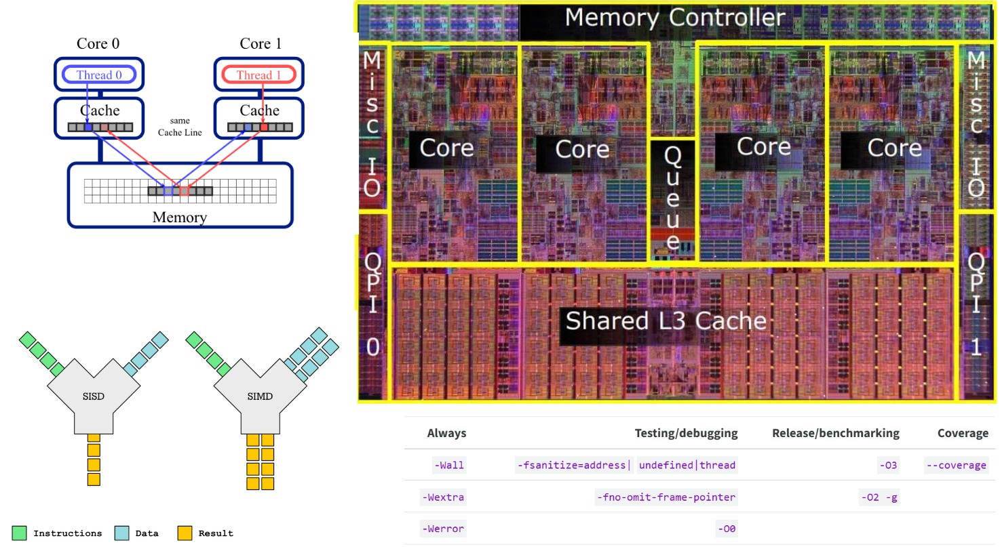

> Because you’re a C++ programmer, there’s an above-average chance you’re a perfor‐
mance freak. If you’re not, you’re still probably sympathetic to their point of view. (If
you’re not at all interested in performance, shouldn’t you be in the Python room
down the hall?)
>
> From item 42 of S. Meyers “Effective Modern C++”, 2015.

This note describes my personal view on how to write effective and reliable C++ code intended to run on CPUs. It uses C++ examples, but much of the discussion about CPUs, caches, memory access patterns, and profiling is language-agnostic and therefore relevant to Rust, Go, and other compiled languages as well. The note is intended to be a brief introduction; if you outgrow the information here, the next step would be [What Every Programmer Should Know About Memory](http://codelabs.ru/reading/drepper-wepskam.pdf). For language-specific best practices, I would recommend S. Meyers' “Effective Modern C++”.

# Before you start

> We should forget about small
efficiencies, say about 97% of the time: premature optimization is the root of all evil.
Yet we should not pass up our opportunities in that critical 3%
>
> D. Knuth “Structured Programming with go to Statements” (ACM Computing Surveys, 6(4), 1974).

This idea has aged gracefully. It was expressed 50 years ago, yet it is still true despite how much software development has changed. Not all code is performance-critical, and that is actually great. For example, in ML/AI, matrix multiplication and attention KV caches account for 99.9% of the computations; everything else can be written in Python without any significant degradation. The point is that, if you are results-oriented, you should be aware that a small amount of code usually accounts for most of the runtime. This is usually referred to as a "bottleneck." Detecting bottlenecks is the first priority in HPC development. If you start optimizing before identifying bottlenecks, positive results will probably occur only in a few very obvious cases, such as using a quadratic sorting algorithm. In most other cases, you will most likely end up optimizing something unimportant.

With that said, there are two common mechanisms to detect bottlenecks:

- *Benchmarks*, i.e. performance measurements for target cases
- *Profiling*, i.e. in-depth source code analysis by running the code under *profilers*, which typically provide per-function or per-line CPU time percentages and many other metrics.

More on these later.

## Fast code is often less reliable

A canonical example is the difference between the `at` method and `operator[]` in `std::vector`. The difference between them is that `at(i)` checks whether `i < size()` and throws an `std::out_of_range` exception, while `operator[]` does not and results in undefined behaviour (UB) if `i >= size()`. `operator[]` performs fewer operations, but it is less reliable than `at`, and the developer is responsible for ensuring that `operator[]` is not called with `i >= size()`.

In performance-critical code, we probably want to use `operator[]` and a lot of other techniques that can lead to less reliable code. Here are a few standard things that can be done to increase reliability:

- **Compiling with pessimistic flags**, i.e. `-Wall -Wextra -Werror`
- **High test coverage**, i.e. ideally there should be no source code lines that are not executed during testing, but even 100% coverage does not guarantee that problems will not appear later. Test coverage can be measured with a coverage build.
- **Testing with sanitizer builds**. Standard C++ sanitizers include `address`, `undefined`, and `thread`. These are instrumented builds with additional checks. For example, an AddressSanitizer build would detect an out-of-bounds `operator[]` call.

*Note: many developers believe that this is a must-have in any C++ project.*

## Build types

<!-- |Always|Testing/debugging|Release/benchmarking|Coverage|
|-------:|---:|----:|----:|
|`-Wall`|`-fsanitize=address|` `undefined|thread`|`-O3`|`--coverage`|
|`-Wextra`|`-fno-omit-frame-pointer`|`-O2 -g`|
|`-Werror`|`-O0`| | | -->

Here are the standard build variants (in CMake style):

- **Debug**: a basic diagnostic build. It can be run in something like gdb with the ability to stop at any specific line during execution and inspect the current state of the program (variables, memory, etc.). It is usually compiled with optimizations disabled via `-O0`.
- **Release**: the default build for production use. In many toolchains it uses `-O3`-level optimizations and is usually much faster than Debug. Due to these optimizations, debugging is more limited because there is no clear correspondence between source lines and the produced binary.
- **RelWithDebInfo**: a diagnostic build with `-O2 -g` flags, with slightly less optimized code than a Release build but with clearer behavior when executed in a debugger or analyzed with profilers.

Non-standard but recommended builds:

- **AddressSanitize**: compiles and links with `-fsanitize=address -fno-omit-frame-pointer`. This makes the target program very sensitive to memory-usage errors. There are other sanitizers, such as undefined-behaviour or thread sanitizers, but AddressSanitizer is the most important for our case.
- **Coverage**: builds with `--coverage` to later generate coverage reports, i.e. running tests and checking which source code lines were hit and which ones were not.

Release and RelWithDebInfo are for benchmarking and profiling, AddressSanitize and Coverage are for testing, and Debug is, well, for debugging.

# CPU basics

We now know how to produce relatively reliable code, but we still need some knowledge about hardware before we start optimizing it.

## CPU processes things sequentially ... or is it?

If you have ever read articles describing the difference between GPUs and CPUs, the first thing they usually tell you is that a GPU is designed for massive parallelism while a CPU is designed for sequential computations. While this is true, there is still *some* parallelism in a CPU. It is not as powerful as on a GPU, but it is still very important, and it comes from the following:

- **Multiple cores**: probably the most obvious one
- **Multiple logical units**: inside a single core there is typically more than one unit that actually performs work: arithmetic units (ALUs), floating-point units (FPUs), branch predictors, specialized units for cryptography, and so on.
- **SIMD units**: these units deserve a separate mention. Most computations are performed via arithmetic on machine words, which are most often 64-bit integers. In some special cases, when we want to perform a single operation over multiple data elements (i.e. *SIMD*, for single instruction multiple data), it can be assembled into a single instruction over 128-, 256-, or 512-bit registers. One can expect 256-bit registers to be available on most modern Intel CPUs, while 512-bit registers are likely to remain state of the art for quite some time.

I am not quite qualified to describe in detail how the CPU pipeline works, but I am sure that proper use of the above can easily achieve 10x-100x speedups for the same code. A lot of C++ compiler optimization comes from reshuffling assembly instructions. Techniques like loop unrolling or manual SIMD programming are still viable as well.

## RAM stands for *random access memory* ... or is it?

The initial idea behind RAM is that the CPU has uniform access to any of its cells, but in reality the access is not uniform. It is *uniform enough*, but typical reference values for access latency are 70-120 ns. Once again, I am not qualified to describe in detail how memory works, and I refer you to [What Every Programmer Should Know About Memory](http://codelabs.ru/reading/drepper-wepskam.pdf) for this.

More important than the non-uniformity of RAM is the fact that it is much slower than the CPU. For example, frequencies on Intel processors range from roughly 1 to 6 GHz, i.e. 0.2-1.0 ns per cycle, while RAM access is around 100 ns. This difference is the main motivation behind CPU caches: we need some fast intermediate storage for data. There is a simple law that applies to any memory storage: *the larger the storage is, the slower it can be accessed*. The CPU/RAM memory hierarchy is as follows:

| Level (closest → farthest) | Typical size | Typical access time (cycles) | Typical access time (ns) | Notes |
|---|---:|---:|---:|---|
| Registers | ~0.5–4 KiB architectural state (ISA-dependent) | ~0–1 | ~0–0.3 | Operands are read as part of execution; effectively “free” vs cache/memory. |
| L1 D-cache | ~32 KiB / core | ~3–5 | ~1.0–1.5 | Fastest data cache; 64B lines typical. |
| L1 I-cache | ~32 KiB / core | ~3–5 (fetch side) | ~1.0–1.5 | Instruction fetch; usually similar scale to L1D. |
| L2 cache | ~512 KiB – 2 MiB / core | ~10–16 | ~3–6 | Often private per core (or per small cluster). |
| L3 / LLC (shared) | ~16–96 MiB (system-wide typical) | ~30–60 | ~10–25 | Shared across cores; varies by slice/mesh hop/chiplet topology. |
| DRAM (local NUMA) | ~8–512+ GiB (system-wide) | ~150–300+ | ~60–120+ | Highly variable: row hits/misses, contention, controller queueing. |
| DRAM (remote NUMA) | same | ~250–500+ | ~100–200+ | Extra interconnect hop(s); can be worse under load. |

When, for example, you perform a linear scan of an array with some processing over its elements, a combination of caching (e.g. storing data in higher cache levels if it was accessed recently) and prefetching (preemptively loading blocks of data that are likely to be accessed soon) is used. Notably, the access pattern of a linear scan over an array is easy to predict, while a linear scan over a linked list is not. This is actually one of the reasons linked lists are not recommended very often.

## Address alignment

A few more details should be given about CPU-cache-RAM interaction. The basic unit a cache operates on is a *cache line*, which is a 64-byte block on most CPUs. Caches and memory subsystems operate on *aligned cache lines* internally, i.e. RAM is virtually divided into blocks of the same size as cache line, when you request an arbitrary block from the RAM it will load all the cache line blocks that are responsible for data of the requested block. There is a small problem with this approach: suppose that you have an array of objects and you want to process them in batches using SIMD instructions. Let us say that we use 512-bit AVX-512 instructions and the cache-line size is also 512 bits. If the beginning of the array is aligned with the beginning of a cache-line block, then processing a single batch may require a single cache-line load/store plus the corresponding processing. If the array is not aligned, however, the operation may need two loads/stores instead. This would not necessarily be a problem during a linear scan, but if the access is isolated, it might lead to significant performance degradation.

To guarantee address alignment, C++17 provides the `std::aligned_alloc` allocation function, parameterized by the alignment requirement, and the `alignas(...)` specifier.

*Remark:* on Windows/MSVC, `std::aligned_alloc` has historically been less portable in practice than on POSIX-like platforms, and many codebases still rely on `_aligned_malloc`/`_aligned_free` or allocator abstractions instead.

## False sharing 

Last but not least, false sharing is a common problem in multithreaded code. Suppose that we are trying to use several threads to utilize multiple CPU cores. Recall that each core has its own private caches (at least L1, and often L2), while some higher cache levels may be shared. The problem appears when different threads write to different variables that just happen to live on the same cache line. Even though the variables are logically independent, cache coherence still tracks ownership at cache-line granularity, so the whole line keeps bouncing between cores.

Note that this is not the result of a data race: the threads may operate on completely separate elements, but if those elements occupy the same cache line, performance can still degrade badly. Here is a minimal example:
```cpp
for (int i = 0; i < arr.size(); i += thread_count) {
  for (int t = 0; t < thread_count; ++t) {
    DoWorkInSeperateThread(arr[i + t]);
  }
}
```
Threads work with different elements, but due to the alternating access pattern, a single cache line can easily contain data that several threads try to update. For example, if `arr` contains 64-bit `int`s and the cache line is 64 bytes, then one cache line contains 8 elements. With this access pattern, 8 neighboring threads may repeatedly invalidate one another's cache lines even though they never touch the same array element. A better variant would be:
```cpp
for (int t = 0; t < thread_count; ++t) {
  auto block_size = (arr.size() + thread_count - 1) / thread_count;
  for (int i = 0; i < block_size && (i + t * block_size) < arr.size(); ++i) {
    DoWorkInThread(arr[i + t * block_size], threads[t]);
  }
}
```
In this case, the amount of false sharing is much smaller because each thread mainly works on its own contiguous block. Some interaction may still happen near block boundaries, and in performance-critical code one may even want to pad or align per-thread regions so that independent writers do not share cache lines at all.

# Diagnostic tools

We are now ready to optimize our code, but first we need to identify bottlenecks.

## Benchmarks

Technically, one can write benchmarks manually by using `std::chrono::high_resolution_clock`, but there are many pitfalls in benchmarking, so it is recommended to use standard libraries for that. Here are the most common ones:

- [Google benchmark(recommended)](https://github.com/google/benchmark)  
- [ankerl::nanobench](https://github.com/martinus/nanobench)
- [Catch2](https://github.com/catchorg/Catch2)

These libraries provide common tools for benchmarking: structured output, proper statistics, warmups, and so on. Google Benchmark, for example, contains a function called `DoNotOptimize` to avoid a common benchmarking mistake where the compiler optimizes code away because it does not affect the result.

## Profilers

### Windows

The methods described here will work on Linux, and I really recommend using WSL/Linux anyway, but if you need to do it on Windows, then **Intel VTune** is the best choice. If you work on an Intel CPU, go for VTune; unfortunately, it will not be as good for other processors. AMD has `uProf`, but my experience with it was so bad that I recommend using almost any other available option.

Note that you can always install the Windows Subsystem for Linux (WSL) on Windows and do profiling there.

### Linux/WSL

The basic tool is the `perf` utility (on Ubuntu-like systems it is usually installed via packages from the `linux-tools-*` family). The basic pipeline is:

- `perf record -o <profile_dump> <command>`, which runs `<command>` and collects profile data with relatively little overhead. Check the `--event` option for what exactly you want to measure: cycles, cache misses, branch mispredictions, and so on.
- `perf annotate <profile_dump>`, which inspects the profile in a command-line interface, though I suggest using other tools such as `hotspot`.

Note that useful information will only be available if the code is compiled in `RelWithDebInfo` mode, i.e. with `-O2 -g` flags. It is also worth noting that Google Benchmark has internal support for hardware events. To enable it, set `BENCHMARK_ENABLE_LIBPFM=ON` and install `libpfm4-dev`. With this enabled, Google Benchmark can aggregate the requested hardware counters for the benchmarked functions.

Another great Linux option is **valgrind**. It covers a somewhat different class of tasks and is easy to use, but there is one problem: it is terribly slow. It can produce very useful measurements, but runtime can slow down by an order of magnitude.

# Optimization priorities

We now know how to find bottlenecks, so we should be ready to optimize our code. Here is the last chunk of what and why, along with the recommended priority in descending order.

## Asymptotic complexity

With all that I said above, it might be surprising that I put *this* topic at the top priority, and I understand that. I do not have precise data for this, but I believe that the majority of software performance problems in general come from misuse of standard containers, i.e. arrays, queues, stacks, hash tables, binary search trees, and so on. I also believe this to be true in any language. In most cases, if binary search is applicable, then it is either faster than linear search or the problem will never become a bottleneck. The same goes for quadratic versus logarithmic sorting algorithms and many other things.

On the other hand, if we start digging deeper and consider something sufficiently more complex than STL algorithms and data structures, we soon end up in a domain where good asymptotic complexity rarely translates into good practical performance. Unfortunately, in this respect theory diverged from practice about 30 years ago. Here are the main reasons:

- Most of the simple ideas that are effective both in practice and in theory were developed a long time ago.
- Asymptotically better means better at infinity; sometimes it practically means infinity. So-called [galactic algorithms](https://en.wikipedia.org/wiki/Galactic_algorithm) may be the best in theory, but they will never become practical.
- Simplified computational models. There is theoretical work that takes additional aspects into account compared to traditional Turing-machine-based complexity, such as machine word size, cache-oblivious algorithms, or the external memory model, but models that work well in both theory and practice are rare.
- There are still domains like cryptography where asymptotic complexity matters most

Finally, here is a small but interesting example: I wrote earlier that quadratic sorting algorithms can outperform logarithmic ones, and there is a very famous empirical fact that for fewer than about 16 elements, insertion sort is the fastest. This is used in GCC and MSVC, and it was also used in Clang prior to some discoveries from [AlphaDev](https://en.wikipedia.org/wiki/AlphaDev#LLVM_standard_sorting_library).

Anyway, the main point is that asymptotic complexity is very important, but a good engineer should know when it matters and when it does not.

## Memory access patterns

The importance of this follows directly from the sections about RAM and CPU caches. The best example where this is the most important factor is matrix multiplication. Consider *the textbook* implementation:
```cpp
for (int i = 0; i < n; ++i) {
  for (int j = 0; j < n; ++j) {
    for (int k = 0; k < n; ++k) {
      c[i][j] += a[i][k] * b[k][j];
    }
  }
}
```
Here we assume that `a`, `b`, and `c` are `std::vector<std::vector<float>>` or something similar. This implementation would hardly achieve 1% of peak performance on any CPU due to a very bad memory access pattern. Any manual on how to make matrix multiplication faster starts by changing the loop order from `ijk` to something like `ikj`, which replaces a bad column scan in the inner loop with a good row scan and leads to a performance improvement of 3x-10x. Achieving near-peak performance would require very precise control over data flow between cache and registers, plus SIMD, multithreading, and alternative matrix layouts (check, for example, this recent [video](https://www.youtube.com/watch?v=GHctcSBd6Z4) on the topic). The important point is that none of this is an asymptotic optimization. Moreover, to my knowledge, no subcubic algorithms for matrix multiplication are good in practice, except perhaps some basic Strassen variants for large matrices.

## Vectorization/SIMD

We have touched on SIMD several times already. If you have complex computations and I/O is not the bottleneck, you want to make sure you use algorithms that can utilize SIMD. At this point, you will want another great tool, [godbolt.org](godbolt.org), mainly to explore assembly output. This is an easy way to check what instructions are produced. In some simple cases, the compiler will do the work for you, for example in linear scans with simple aggregation. Sometimes, however, you need to do it manually; check, for example, this usage of parallel table lookup in [simdjson](https://github.com/simdjson/simdjson/blob/master/src/generic/stage1/utf8_lookup4_algorithm.h).

Here is another example of when SIMD matters: if you check the implementation of `string::find` in [GCC](https://github.com/gcc-mirror/gcc/blob/master/libstdc%2B%2B-v3/include/bits/basic_string.tcc) or [Clang/libc++](https://github.com/llvm/llvm-project/blob/main/libcxx/include/string), you would probably be surprised to see a fairly "naive" search structure in the implementation. Why do they not implement an awesome $\mathcal{O}(n)$ [Knuth-Morris-Pratt](https://en.wikipedia.org/wiki/Knuth–Morris–Pratt_algorithm) algorithm everywhere? I am pretty sure they are capable of doing it. The reason is that, although the naive algorithm requires more comparisons, those comparisons are easy to group into chunks. Strings of 32 bytes can be compared on most CPUs in a single SIMD instruction, and AVX-512 can compare 64-byte strings, which covers the majority of use cases. KMP, on the other hand, needs sequential comparisons that are hard to optimize via SIMD. C++17 also provides an alternative function, [`std::boyer_moore_searcher`](https://en.cppreference.com/w/cpp/utility/functional/boyer_moore_searcher.html), in case you have an unusual string-search case.

For more details on SIMD, check the [Intel](https://www.intel.com/content/www/us/en/docs/intrinsics-guide/index.html) and [ARM](https://developer.arm.com/architectures/instruction-sets/intrinsics/) intrinsics guides. Also note that `std::simd` is coming in C++26.

## Branching

The branching problem is universal for any kind of pipelined or parallel execution. If you know in advance what you will do next, there is an opportunity for optimization, but if at some point you need the current state and have to decide what to do next based on that state, you lose the opportunity to plan ahead. Unfortunately, this is also true for CPUs. In some situations, branchless code can be more efficient than an explicit branch, but that depends heavily on the data, the compiler, and the target microarchitecture. For example, code like
```cpp
result = condition * if_expression + !condition * else_expression;
```
which always evaluates `if_expression` and `else_expression` may outperform a traditional `if`
```cpp
if (condition)
  result = if_expression;
else
  result = else_expression;
```
where only one of the expressions is evaluated.

In any case, avoid unnecessary branching in performance-critical code. C++20 provides the attributes `[[likely]]` and `[[unlikely]]`, by which the developer can hint to the compiler about the expected branch probability. These attributes are just hints, not guarantees of a particular execution strategy.

## Arithmetics

The situations where you need to optimize arithmetic computations are relatively rare. If you end up in such a situation, there is not much I can help you with beyond recommending [godbolt.org](godbolt.org), which is one of the most useful tools here. Also be aware of what the processor provides, because there is much more than just standard integer and boolean arithmetic, for example BMI/BMI2 (bit manipulation), FMA (fused multiply-add), AES (Advanced Encryption Standard), CLMUL (carry-less multiplication), GFNI (Galois field new instructions), and others.

# References

- Donald E. Knuth, “Structured Programming with go to Statements”, *ACM Computing Surveys*, 6(4), 1974.
- Scott Meyers, *Effective Modern C++*, O'Reilly Media, 2015.
- Ulrich Drepper, [What Every Programmer Should Know About Memory](http://codelabs.ru/reading/drepper-wepskam.pdf).
- [Google Benchmark](https://github.com/google/benchmark)
- [ankerl::nanobench](https://github.com/martinus/nanobench)
- [Catch2](https://github.com/catchorg/Catch2)
- [Intel Intrinsics Guide](https://www.intel.com/content/www/us/en/docs/intrinsics-guide/index.html)
- [ARM Intrinsics Search Engine](https://developer.arm.com/architectures/instruction-sets/intrinsics/)
- [simdjson](https://github.com/simdjson/simdjson)
- [GCC libstdc++ `basic_string` implementation](https://github.com/gcc-mirror/gcc/blob/master/libstdc%2B%2B-v3/include/bits/basic_string.tcc)
- [LLVM libc++ `string` implementation](https://github.com/llvm/llvm-project/blob/main/libcxx/include/string)
- [cppreference: `std::boyer_moore_searcher`](https://en.cppreference.com/w/cpp/utility/functional/boyer_moore_searcher.html)
- [Wikipedia: Galactic algorithm](https://en.wikipedia.org/wiki/Galactic_algorithm)
- [Wikipedia: Knuth-Morris-Pratt algorithm](https://en.wikipedia.org/wiki/Knuth%E2%80%93Morris%E2%80%93Pratt_algorithm)
- [Wikipedia: AlphaDev](https://en.wikipedia.org/wiki/AlphaDev#LLVM_standard_sorting_library)
- [How to Multiply Matrices Fast](https://www.youtube.com/watch?v=GHctcSBd6Z4)
