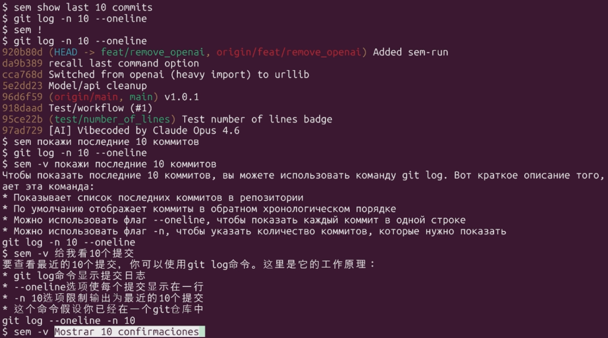

## Motivation

I mostly work on Linux, and the terminal is one of my main tools. Still, in day-to-day work that is mostly `ls`, `mkdir`, `cd`, `git`, `grep`, `htop`, `ssh`, and maybe another dozen commands. I do not remember all available flags/options, and honestly I do not want (or cannot) memorize everything.

That is why CLI tools usually have `--help`: it is there to remind you. But even with `--help`, there is still a big layer of "how do I do X in shell quickly?" tasks. I am sure some people know Unix internals deeply; I am not one of them.

For a long time, whenever I forgot a command, I just opened Google and searched for a one-liner. With tools like Claude Code and OpenCode, you can do the same directly in a terminal, and I use that a lot (not just me, obviously). But I still spend a lot of time in a regular terminal and do not want to fully replace it with AI terminals. So I wanted a Unix-style command that does exactly this "go to Google/SO" step for me.

## Why not use an existing solution?

The solution from the article ["I replaced Google with 50 lines of Python. A month later I forgot how to write tar -xzf"](https://habr.com/ru/articles/1001214/) is good, but for me it felt unfinished.

Alternatives mentioned in comments (plus what I found myself) were mostly broader AI-terminal workflows, while I wanted a strict Unix-style utility: one command, one job.

## What I built

So I opened my laptop, started coding, launched an AI terminal, described the task, and went to drink tea while watching random YouTube videos, checking progress from time to time. The result is a Python package, [semantic-terminal](https://github.com/Malkovsky/semantic-terminal): installable via pip, exposing a single command `sem`.

```bash
sem <description>    # Generate a command
sem -r <description> # Generate and run a command
sem -v <description> # Generate and explain a command
sem ! or sem -r      # Run the last generated command
sem ?                # Print the last generated command again
```

The core idea is simple: in generation mode, pass the description to an LLM with "Produce a single-line shell command". Everything else is convenience around that.

## Two key features

The 50-line script concept appealed to me: minimalistic, only what is needed. But it had two important issues for my use case (and one minor one). Starting with the minor one: I personally dislike interactive flows, so I made two explicit modes instead - generate and execute.

Now the two important issues.

The first one: generated commands are executed in a child process, and from Python there is no way to make that command appear in your shell history directly. So after execution, it is harder to rerun or find that command from history. To work around this, I added optional bash/powershell wrappers: `sem-run`, installable via `sem-setup`.

The second one: sometimes you want not only the command, but also understanding. So I added `--verbose`, which returns both the command and an explanation. A nice side effect: modern LLMs are multilingual, so by default you often get explanations in the same language as your request. I tested it with Russian, English, Chinese, and Spanish.

## Quick start

Install from PyPI:

```bash
pip install semantic-terminal .
```

Then configure your LLM. The easiest/fastest setup I found so far is a free Groq account: https://console.groq.com. Get an API key and run:

```bash
sem config set api_key
```

Then paste the key. Full configuration options are documented in the README.

If you want executed commands to appear in shell history, run:

```bash
sem-setup
```

After that, use `sem-run` for execution instead of `sem -r` / `sem !`.

## Examples

One request, different modes: `sem show last 10 commits`.

First, using `sem !`:

```bash
$ sem show last 10 commits
$ git log -n 10 --oneline
$ sem !
$ git log -n 10 --oneline
3111e16 (HEAD -> main, tag: v1.2.0, origin/main) Feat/remove OpenAI (#2)
96d6f59 v1.0.1
918daad Test/workflow (#1)
95ce22b (test/number_of_lines) Test number of lines badge
97ad729 [AI] Vibecoded by Claude Opus 4.6
$ history 5
  368  sem !
  369  history
  370  sem show last 10 commits
  371  sem !
  372  history 5
```

As you can see, history stores `sem !`. Now the same flow with `sem-run`:

```bash
$ sem show last 10 commits
$ git log -n 10 --oneline
$ sem-run
$ git log -n 10 --oneline
3111e16 (HEAD -> main, tag: v1.2.0, origin/main) Feat/remove OpenAI (#2)
96d6f59 v1.0.1
918daad Test/workflow (#1)
95ce22b (test/number_of_lines) Test number of lines badge
97ad729 [AI] Vibecoded by Claude Opus 4.6
$ history 3
  384  sem show last 10 commits
  385  git log -n 10 --oneline
  386  history 3
```

Now multilingual `-v` examples from the repository.

Russian:

```bash
$ sem -v покажи 10 последних коммитов деревом
Чтобы показать последние коммиты в виде дерева, вы можете использовать команду git log с опцией --graph. Вот что делает эта команда:
* Показывает последние коммиты в виде дерева, где каждая ветка представлена отдельной линией
* Опция --graph позволяет визуализировать историю коммитов
* Опция -10 ограничивает вывод до 10 последних коммитов
* Команда git log используется для просмотра истории коммитов
git log --graph -10
```

Chinese:

```bash
$ sem -v 使用树显示10个提交
要显示10个提交记录，可以使用git log命令并结合--oneline和--graph选项来以树形结构显示提交历史。以下是关键点：
* git log命令用于显示提交历史
* --oneline选项使每个提交记录只显示一行
* --graph选项使提交历史以树形结构显示
* --all选项显示所有分支的提交记录
* 使用head选项可以限制显示的提交记录数量
git log --graph --oneline --all -10
```

Spanish:

```bash
$ sem -v Mostrar 10 confirmaciones con el árbol
Para mostrar 10 confirmaciones con el árbol, puedes utilizar el comando git log con las opciones --oneline y --graph. Aquí hay algunos puntos clave sobre este comando:
* El comando git log se utiliza para mostrar un registro de confirmaciones.
* La opción --oneline muestra cada confirmación en una sola línea.
* La opción --graph muestra el árbol de confirmaciones.
* La opción -10 limita la salida a las 10 últimas confirmaciones.
* Este comando asume que estás en el directorio raíz de un repositorio git.
git log --oneline --graph -10
```

One more thing: the whole flow is quite fast (`llama-3.3-70b-versatile` on Groq). The demo below is not speed-edited and has no cuts between command execution and response output.


If this tool looks useful, feel free to star the repository.
