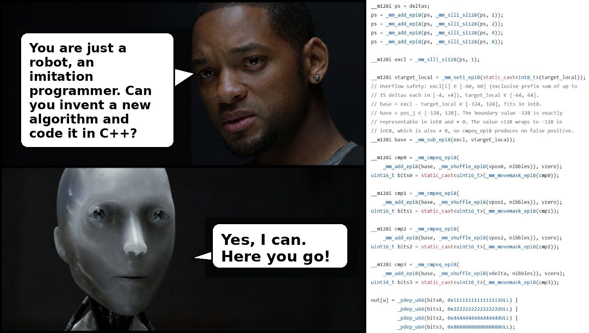
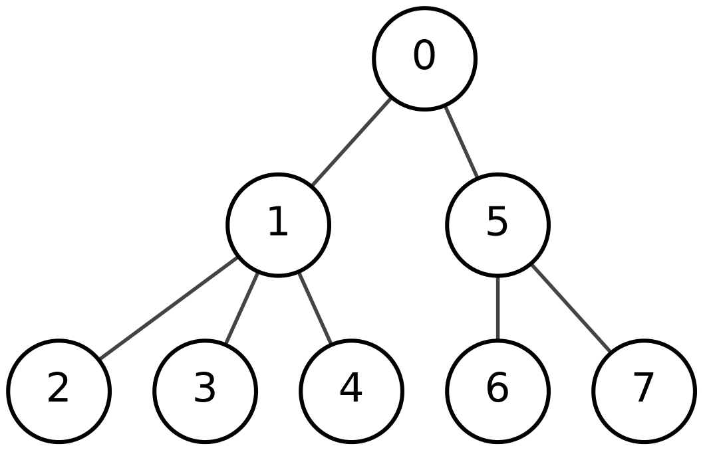
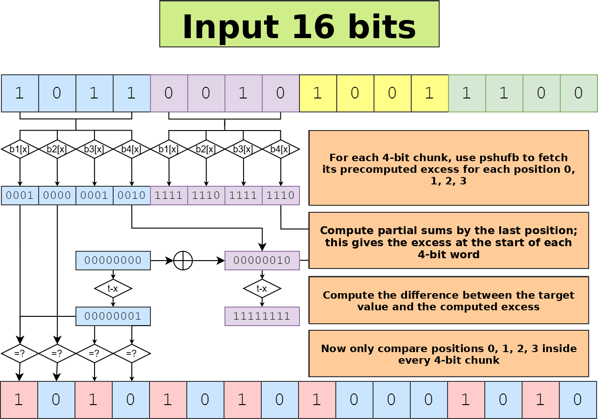

Friends, I know the internet is already full of AI praise, and that frustrates many people, especially specialists, particularly when the discussion turns to C/C++ code. I am not an AI evangelist. I am just an active, responsible programmer who uses AI tools. Recently I asked AI, more precisely opencode + GLM-5.1, to invent an algorithm for one of the tasks I was working on, and it did a very good job. This is not a breakthrough algorithm that will make me rich, but it is interesting: assembled from known components, yet still new. In this post I will cover:

- How to solve the problem "given a bit string, find all positions where the number of ones minus the number of zeroes equals a given value"
- What AI came up with for this task
- What I use to make AI write reasonable C++ code

If you are interested in algorithms and data structures, this problem appears in the context of RMQ/LCA.

## Preamble

Let us start by formalizing the problem. Suppose we have a sequence $B:\{1, \ldots, n\}\rightarrow \{0, 1\}$, where $B[i]$ is the $i$-th bit of the sequence. Define excess as $E_B:\{0, \ldots, n\}\rightarrow \mathbb{Z}$:

$$
E_B[i] = \sum_{j=1}^i 2B[j]-1,
$$

That is, $E_B[i]$ is the number of ones minus the number of zeroes in the first $i$ bits of $B$. Our task is: given $k$, find all $i$ such that $E_B[i]=k$. The main use case for this problem is processing balanced parentheses sequences: for example, finding a matching parenthesis or the nearest enclosing pair of parentheses. Why do we need that? It lets us navigate trees through a parentheses representation. I do not want to go deep into the details here; this is a simple BP representation example: during a depth-first traversal, write 1 every time we descend one level and 0 every time we go back up.




Each vertex corresponds to a pair of parentheses, and the whole subtree of a vertex corresponds to the subsequence between those parentheses. For navigation it is useful to find the matching parenthesis from one parenthesis. More generally, all possible tree-navigation operations reduce to this task: *given a bit string $B$, a position $i$, and a value $k$, find the minimum $j\geq i$ such that $E_B[j]=E_B[i]+k$*. The universal data structure for solving this task is a range min-max tree, which I will cover in another post. The key facts about it are:

- It solves the task above in $\mathcal{O}(\log n)$
- For maximum efficiency it is built over blocks whose length is chosen so that search inside a block can be done quickly by alternative methods.

The solution for short blocks is exactly what we will look at next.

## Baseline

There is not much research on this topic, so I will describe the method used in the only public implementation of a range min-max tree that I know of.

[Sdsl-Lite](https://github.com/simongog/sdsl-lite/blob/master/include/sdsl/bp_support_algorithm.hpp#L48)

Essentially, it is a table-based method: for every possible 8-bit sequence $B$ and every value of $k$, precompute the mask where $E_B[i]=k$. For an arbitrary sequence $B$, split it into 8-bit blocks, scan the blocks sequentially, use the table on each block, and update $k$. Note that the excess of the whole block is easy to compute as `2*popcount(B)-8`.

## What GLM-5.1 Suggested

SIMD has a way to perform parallel table lookups with `pshufb`, and many practical techniques are based on that instruction. It is not immediately clear whether the method from the previous section can be generalized cleanly. Methods based on `pshufb` need tables of size 16; GLM-5.1 suggested this variant:

- For a block of $4$ bits, precompute the excess at each of the 4 positions; the last value is the excess of the whole block.
- Compute prefix sums of excess at the boundaries of all 4-bit blocks.
- For each 4-bit chunk `i` and each offset 0, 1, 2, 3, check whether the value equals `target-E[4i]`.
- Combine everything into a single result mask.



The precomputation is four tables, each consisting of 128, 256, or 512 bits.

<details>
<summary>Excess tables for AVX2</summary>

```cpp
// LUT for total excess change across a 4-bit nibble
static inline const __m256i excess_lut_delta = _mm256_setr_epi8(
    -4, -2, -2,  0, // 0000, 0001, 0010, 0011
    -2,  0,  0,  2, // 0100, 0101, 0110, 0111
    -2,  0,  0,  2, // 1000, 1001, 1010, 1011
     0,  2,  2,  4, // 1000, 1001, 1010, 1011
    -4, -2, -2,  0, // 0000, 0001, 0010, 0011 (repeat)
    -2,  0,  0,  2, // 0100, 0101, 0110, 0111 (repeat)
    -2,  0,  0,  2, // 1000, 1001, 1010, 1011 (repeat)
     0,  2,  2,  4  // 1100, 1101, 1110, 1111 (repeat)
);

static inline const __m256i excess_lut_pos0 = _mm256_setr_epi8(
    -1,  1, -1,  1, // 0000, 0001, 0010, 0011
    -1,  1, -1,  1, // 0100, 0101, 0110, 0111
    -1,  1, -1,  1, // 1000, 1001, 1010, 1011
    -1,  1, -1,  1, // 1100, 1101, 1110, 1111
    -1,  1, -1,  1, // 0000, 0001, 0010, 0011 (repeat)
    -1,  1, -1,  1, // 0100, 0101, 0110, 0111 (repeat)
    -1,  1, -1,  1, // 1000, 1001, 1010, 1011 (repeat)
    -1,  1, -1,  1  // 1100, 1101, 1110, 1111 (repeat)
);

static inline const __m256i excess_lut_pos1 = _mm256_setr_epi8(
    -2,  0,  0,  2, // 0000, 0001, 0010, 0011
    -2,  0,  0,  2, // 0100, 0101, 0110, 0111
    -2,  0,  0,  2, // 1000, 1001, 1010, 1011
    -2,  0,  0,  2, // 1100, 1101, 1110, 1111
    -2,  0,  0,  2, // 0000, 0001, 0010, 0011 (repeat)
    -2,  0,  0,  2, // 0100, 0101, 0110, 0111 (repeat)
    -2,  0,  0,  2, // 1000, 1001, 1010, 1011 (repeat)
    -2,  0,  0,  2  // 1100, 1101, 1110, 1111 (repeat)
);

static inline const __m256i excess_lut_pos2 = _mm256_setr_epi8(
    -3, -1, -1,  1, // 0000, 0001, 0010, 0011
    -1,  1,  1,  3, // 0100, 0101, 0110, 0111
    -3, -1, -1,  1, // 1000, 1001, 1010, 1011
    -1,  1,  1,  3, // 1100, 1101, 1110, 1111
    -3, -1, -1,  1, // 0000, 0001, 0010, 0011 (repeat)
    -1,  1,  1,  3, // 0100, 0101, 0110, 0111 (repeat)
    -3, -1, -1,  1, // 1000, 1001, 1010, 1011 (repeat)
    -1,  1,  1,  3  // 1100, 1101, 1110, 1111 (repeat)
);
```

</details>

Let me spend a bit more time on prefix sums. Usually prefix sums are a trivial task that can be implemented with a linear pass like this:

The examples below use 0-based indexing: array `B` has length `n`, and `E` has length `n + 1`.

```cpp
E[0] = 0;
for (size_t i = 1; i <= n; ++i) {
  E[i] = E[i - 1] + B[i - 1];
}
```

The problem with this algorithm is that it cannot be parallelized efficiently and performs $\mathcal{O}(n)$ sequential operations. For the SIMD variant, it is better to use the following algorithm:

```cpp
std::copy(B.begin(), B.end(), std::next(E.begin(), 1));
E[0] = 0;
for (size_t offset = 1; offset < n; offset *= 2) {
  for (size_t i = n; i >= offset; --i) {
    E[i] += E[i - offset];
  }
}
```

The difference is that the inner loop is easy to parallelize, while the outer loop performs only $\log_2 n$ iterations. Here is a code snippet that computes prefix sums by bytes:

```cpp
ps = _mm256_add_epi8(ps, _mm256_slli_si256(ps, 1));
ps = _mm256_add_epi8(ps, _mm256_slli_si256(ps, 2));
ps = _mm256_add_epi8(ps, _mm256_slli_si256(ps, 4));
ps = _mm256_add_epi8(ps, _mm256_slli_si256(ps, 8));
```

It is most convenient to process sequences of length 64/128 bits with 128/256-bit registers respectively; if necessary, 512-bit registers can be used by processing two 128-bit sequences in parallel.

The last two steps are mostly engineering, and there are several ways to implement them. GLM-5.1 suggested a working but slightly redundant combination of `cmpeq->movemask->pdep`; below is the workflow description produced by the AI:

```
word ──► nibble extraction ──► nibbles[0..15]
                                    │
              ┌─────────────────────┼─────────────────────┐
              ▼                     ▼                     ▼
     vpshufb(delta)          vpshufb(pos_j)         vpshufb(delta)
         deltas                   rel_j                  rel_3
              │                     │                     │
              ▼                     │                     │
     prefix sum (4 steps)           │                     │
              │                     │                     │
              ▼                     │                     │
     shift left 1 byte              │                     │
     → excl (exclusive psum)        │                     │
              │                     │                     │
              ▼                     │                     │
     base = excl - target_local     │                     │
              │                     │                     │
              ▼                     ▼                     ▼
     base + rel_j ───────────► cmpeq(0) ──────────► movemask → bits_j
                                                           │
              ┌────────────────────────────────────────────┤
              ▼                  ▼                  ▼      ▼
           pdep(0x1…)       pdep(0x2…)       pdep(0x4…)  pdep(0x8…)
              │                   │                │      │
              └───────── OR ───────────────────────┘      │
                                  │                       │
                                  ▼                       │
                              out[w] ◄────────────────────┘
```

The general problem was that every stage of the algorithm manipulates expanded and compressed numbers or masks: in the first part, 4-bit chunks are expanded to 8-bit values; during the equality check, the mask is first compressed to 16 bits via `movemask`, and then placed back into the desired bit positions with stride 4 via `pdep`. As a result, it is not easy to find an alternative to `pdep`, and on current architectures it is a 64-bit BMI2 instruction without a SIMD counterpart.

The final variant can be found here:

[pixie/bits.h](https://github.com/Malkovsky/pixie/blob/afe4b2ed4fc452a575acb8965bd21482d00d4fc1/include/pixie/bits.h#L771)

The full session from problem statement to implementation is available here:
https://opncd.ai/share/UdTGAEAW

(Unfortunately, the interface there is inconvenient; I can publish the Markdown version on request.)

## Performance Analysis

Later I refined the algorithm a bit, and this is what I got:

<details>
<summary>Performance comparison on random data</summary>

`X` is the requested excess; all measurements are on a bit string of length 512.
```
----------------------------------------------------
Benchmark                CPU     Cycles      Instr
----------------------------------------------------
Baseline/X:-64         317 ns   1.36953k   7.18206k
Baseline/X:-8          400 ns   1.74562k   7.20476k
Baseline/X:0           449 ns   1.93589k   7.21562k
Baseline/X:8           397 ns   1.73994k   7.20387k
Baseline/X:64          317 ns   1.37449k   7.18206k
LUTOffset/X:-64       11.2 ns    48.5127    169.882
LUTOffset/X:-8        18.4 ns    81.4704    250.885
LUTOffset/X:0         18.8 ns      81.94    250.927
LUTOffset/X:8         18.6 ns    81.7102    250.853
LUTOffset/X:64        10.7 ns    46.7245    166.554
LUTTransform/X:-64    16.2 ns    70.4105    260.969
LUTTransform/X:-8     27.5 ns     119.56    409.788
LUTTransform/X:0      26.9 ns   118.3430    409.865
LUTTransform/X:8      27.3 ns   119.1410    409.730
LUTTransform/X:64     15.8 ns    68.7241    254.855
LUTOffset512/X:-64    12.7 ns    54.7855    184.717
LUTOffset512/X:-8     18.8 ns    81.4390    228.987
LUTOffset512/X:0      18.4 ns    79.5516    228.987
LUTOffset512/X:8      17.7 ns    78.0454    228.973
LUTOffset512/X:64     12.6 ns    54.9331    182.469
Expand16/X:-64        51.2 ns   221.2250    823.130
Expand16/X:-8         84.8 ns   366.6420   1.37054k
Expand16/X:0          84.9 ns   366.7350   1.37077k
Expand16/X:8          85.7 ns   368.6010   1.37031k
Expand16/X:64         49.7 ns   219.0660    795.162
Expand8/X:-64         18.7 ns    80.4250    327.100
Expand8/X:-8         49.1 ns   213.1080    732.712
Expand8/X:0          47.6 ns   205.9740    740.490
Expand8/X:8          47.3 ns   205.6490    733.577
Expand8/X:64         18.1 ns    78.4455    326.288
Expand8_512/X:-64    22.5 ns    98.3215    255.677
Expand8_512/X:-8     37.1 ns   161.9560    336.860
Expand8_512/X:0      36.7 ns   160.9130    336.951
Expand8_512/X:8      36.8 ns   161.6340    336.823
Expand8_512/X:64     22.1 ns    96.5108    253.321
```

</details>

`LUTOffset` is a slightly refined version of the approach described in the previous section; baseline is the byte-table method. The difference is about 20x. The `pdep` variant was roughly 20% slower, which is still an order of magnitude faster.

## Is the Approach New?

Considering how quickly AI came up with it, I initially assumed that this approach had already been described somewhere. However, I never found such an algorithm and came to the following conclusions:

- All components and individual tricks in this approach are known and widely used: 4-bit tables, the prefix-sum algorithm, and the `pdep` pattern
- Their composition into a single algorithm is new

I should note that my role in developing this particular method came down to the prompt: "Please think about a 4-bit-table-based algorithm for excess."

## What I Use for AI Work

First, the work was done with `kilocode`; at the moment its CLI version is `OpenCode` with some additions. For optimizing C++ code, I use an additional set of skills that define a concrete workflow. In short, it comes down to this:

- Use Google Benchmark for performance measurements. Everything that was not measured is speculation.
- Use Google Test for test coverage: fast but incorrect code is useless.
- Use isolated builds to evaluate the performance impact of specific changes.

More details are available here:

[pixie/.kilo/skills](https://github.com/Malkovsky/pixie/tree/main/.kilo/skills)

I plan to extract this into a separate repository and develop it further.

## Conclusion

From what I can see now, there are no global blockers that prevent AI from helping write C++ code. However, very few people are really trying to do this. There are problems, of course: for example, if you ask AI what AddressSanitizer is for, it will beautifully explain how it helps diagnose issues, but it will not run an ASan build by itself while writing code unless explicitly instructed to do so. AI can help with debugging; if you do not believe that, watch this talk from the latest [CppCon](https://www.youtube.com/watch?v=DwhAucfHJjs), but that also requires setup.
