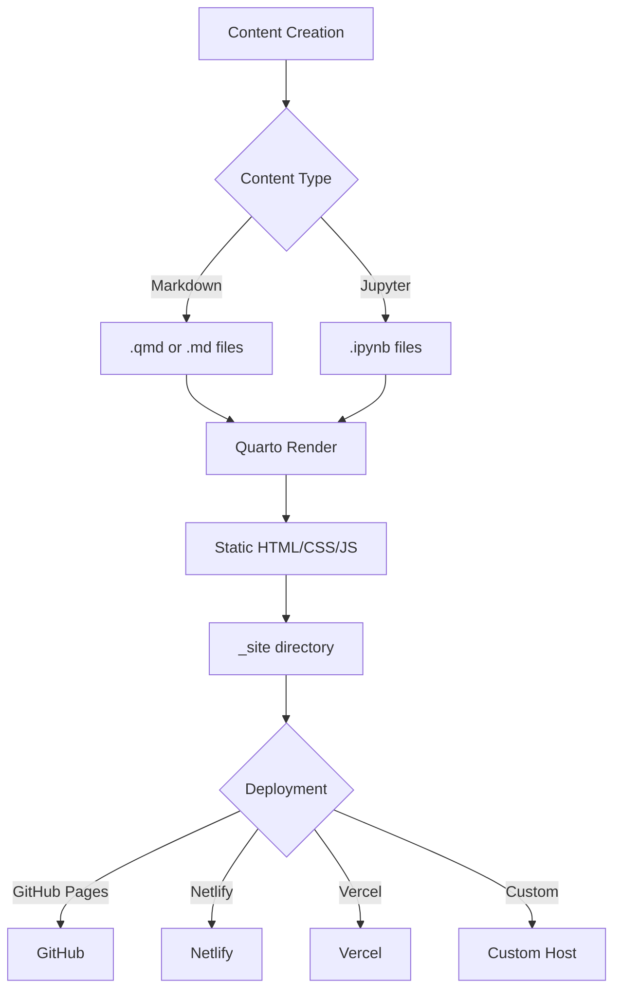
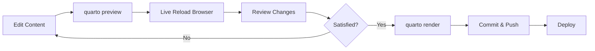

# Personal Website & Blog Architecture Plan

## Overview
This plan outlines the structure for a Quarto-based personal website combining a portfolio and blog. Quarto is ideal for this use case because it:
- Natively supports Markdown and Quarto Markdown (.qmd)
- Has built-in Jupyter notebook support for future integration
- Generates static HTML sites that can be hosted anywhere
- Provides excellent theming and customization options

## Technology Stack
- **Framework**: Quarto
- **Content Format**: Markdown (.md) and Quarto Markdown (.qmd)
- **Future Support**: Jupyter notebooks (.ipynb)
- **Output**: Static HTML/CSS/JavaScript
- **Deployment**: Flexible (GitHub Pages, Netlify, Vercel, or custom hosting)

## Site Structure

```
blog/
├── _quarto.yml                 # Main configuration file
├── index.qmd                   # Homepage
├── about.qmd                   # About page
├── contact.qmd                 # Contact page
├── resume.qmd                  # Resume/CV page
├── publications.qmd            # Publications listing
├── blog/
│   ├── index.qmd              # Blog listing page
│   └── posts/
│       ├── 2026-01-01-welcome/
│       │   ├── index.qmd      # First blog post
│       │   └── images/        # Post-specific images
│       └── _metadata.yml      # Blog posts metadata
├── projects/
│   ├── index.qmd              # Projects showcase page
│   └── _metadata.yml          # Projects metadata
├── styles/
│   ├── custom.scss            # Custom styling
│   └── custom.css             # Additional CSS if needed
├── images/
│   ├── profile.jpg            # Profile photo
│   └── logo.png               # Site logo
├── .gitignore                 # Git ignore file
└── README.md                  # Setup instructions
```

## Page Descriptions

### 1. Homepage (index.qmd)
- Hero section with name and tagline
- Brief introduction
- Quick links to main sections
- Recent blog posts preview
- Featured projects preview

### 2. About Page (about.qmd)
- Personal biography
- Skills and expertise
- Education background
- Interests
- Professional photo

### 3. Blog Section (blog/)
- **Blog Listing** (blog/index.qmd): Automatically generated list of all posts with dates, titles, descriptions
- **Individual Posts** (blog/posts/): Each post in its own directory for better organization
- Support for categories, tags, and dates
- RSS feed support (Quarto can auto-generate)

### 4. Projects Page (projects/index.qmd)
- Grid/card layout of projects
- Each project includes:
  - Title and description
  - Technologies used
  - Links (GitHub, demo, documentation)
  - Optional screenshots
- Filterable by technology or category

### 5. Resume/CV Page (resume.qmd)
- Professional experience
- Education
- Skills
- Certifications
- Download PDF option (can be generated from Quarto)

### 6. Publications Page (publications.qmd)
- Academic or technical publications
- Conference presentations
- Articles and writing
- Citations and links
- Organized by date or category

### 7. Contact Page (contact.qmd)
- Contact information
- Social media links
- Email address
- Professional profiles (LinkedIn, GitHub, etc.)
- Optional contact form (requires backend or third-party service)

## Configuration Architecture

### Main Configuration (_quarto.yml)
The central configuration file will define:

```yaml
project:
  type: website
  output-dir: _site

website:
  title: "Your Name"
  navbar:
    - About
    - Blog
    - Projects
    - Resume
    - Publications
    - Contact
  sidebar: false
  page-footer:
    - Social links
    - Copyright

format:
  html:
    theme: cosmo (or custom theme)
    css: styles/custom.scss
    toc: true
    
execute:
  freeze: auto  # Important for Jupyter notebooks
```

## Styling Strategy

### Custom Styles (styles/custom.scss)
- Color scheme and branding
- Typography
- Component styles (cards, buttons, navigation)
- Responsive design rules
- Dark mode support (optional)

### Theming Options
Quarto provides built-in themes that can be customized:
- Cosmo, Flatly, Minty (modern and clean)
- Lux, Pulse (professional)
- Custom SCSS variables for brand colors

## Content Strategy

### Blog Organization
- Each post in its own directory for better asset management
- Consistent frontmatter (title, date, description, categories, image)
- Support for code blocks with syntax highlighting
- Math equations support via MathJax/KaTeX

### Jupyter Notebook Integration (Future)
Quarto natively supports `.ipynb` files:
- Place notebooks in blog/posts/ just like markdown files
- Code execution happens during render
- Output (plots, tables) automatically included
- Can freeze computations for faster builds

## Workflow Diagram



## Development Workflow



## Key Features

### 1. Navigation
- Fixed top navigation bar with all main sections
- Mobile-responsive hamburger menu
- Breadcrumbs for blog posts
- Search functionality (Quarto built-in)

### 2. Blog Features
- Automatic post listings with pagination
- Category and tag filtering
- RSS feed generation
- Reading time estimates
- Social sharing buttons

### 3. Project Showcase
- Grid layout with project cards
- Hover effects
- Modal or detail pages for projects
- Technology tags/filters

### 4. Responsive Design
- Mobile-first approach
- Tablet and desktop optimized
- Touch-friendly navigation
- Optimized images

### 5. SEO Optimization
- Meta tags for each page
- Open Graph tags for social sharing
- Sitemap generation
- Semantic HTML structure

## Technical Considerations

### Version Control
- Git repository structure
- `.gitignore` for Quarto-specific files (_site/, .quarto/, *.html if generated)
- Separate branches for development/production (optional)

### Build Process
- Local development: `quarto preview`
- Production build: `quarto render`
- Output in `_site/` directory
- Can be automated with CI/CD

### Future Enhancements
1. **Jupyter Integration**: Add computational blog posts with live code
2. **Comments System**: Integrate giscus, utterances, or Disqus
3. **Analytics**: Google Analytics, Plausible, or similar
4. **Newsletter**: Email subscription for blog updates
5. **Search**: Enhanced search with Algolia or Fuse.js
6. **Multi-language**: Quarto supports i18n
7. **Dark Mode**: Theme switcher
8. **Portfolio Items**: Detailed project pages with case studies

## Deployment Options

### GitHub Pages
- Free hosting
- Automatic deployment via GitHub Actions
- Custom domain support
- Requires public repository (or GitHub Pro)

### Netlify/Vercel
- Free tier available
- Automatic deployments from Git
- Custom domains
- Form handling
- Serverless functions support

### Custom Hosting
- Deploy `_site/` directory to any web server
- Apache, Nginx, or static hosting service
- Full control over server configuration

## Prerequisites

### Required Software
- Quarto CLI (latest version)
- Text editor (VSCode recommended)
- Git for version control

### Optional Tools
- Python + Jupyter for notebook support
- R for R-based content (if needed)
- Node.js for additional tooling

## Benefits of This Architecture

1. **Content-First**: Easy to write in markdown, focus on content
2. **Future-Proof**: Built-in Jupyter support when you need it
3. **No Backend**: Static site = fast, secure, cheap hosting
4. **Flexibility**: Easy to customize and extend
5. **Professional**: Academic and research-friendly
6. **Open Source**: All tools are free and well-maintained
7. **Portable**: Can move hosting providers easily
8. **Version Controlled**: Full history of content changes

## Next Steps

Once you approve this plan, we can:
1. Set up the initial Quarto project structure
2. Create configuration files
3. Build template pages for each section
4. Add sample content
5. Customize styling
6. Set up Git repository
7. Prepare deployment documentation

This architecture provides a solid foundation that can grow with your needs while maintaining simplicity and ease of use.
