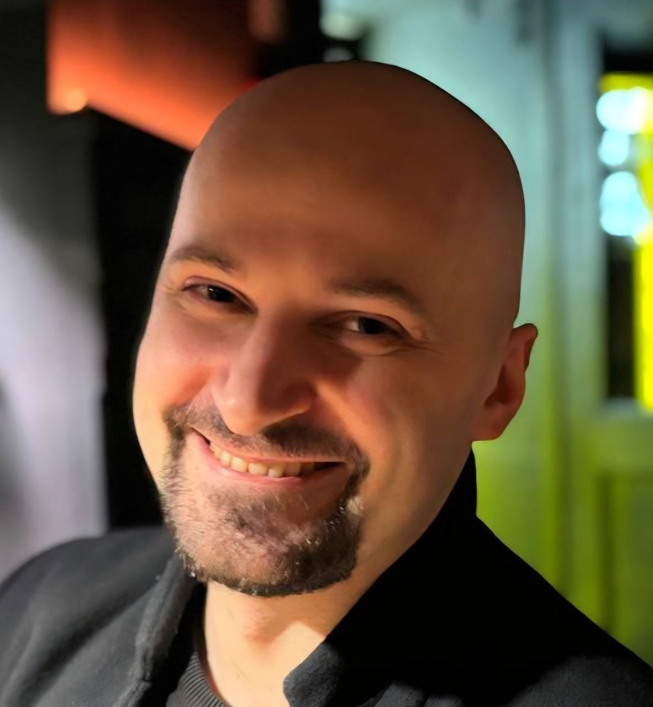

## Очень коротко

::: {style="float: right; margin: 10px;"}
{.profile-photo fig-align="center" width="250px"}
:::

Я кандидат физико-математических наук, работаю главным инженером в Chebyshev Research Center (не путайте с лабораторией Чебышева СПбГУ). У меня за плечами более 10 лет работы в области компьютерных наук, я специализируюсь на научных вычислениях, где имею широкие теоретические знания и проекты в различных областях: системах распознавания речи, избыточном кодировании и компактных структурах данных.

### Чем я занимаюсь

Несколько моих последних проектов:

- **Сетевые протоколы** - Улучшение протокола QUIC для передачи файлов и коммуникации в реальном времени
- **Теория кодирования** - Коды прямого исправления ошибок и их применение для передачи данных в реальном времени
- **Системы распознавания речи** - R&D для гибридных систем HMM-DNN, end-to-end ASR и решений на основе трансформеров

### Образование и карьера

Я закончил специалитет в Санкт-Петербургском государственном университете (2008-2013), и там же защитил кандидатскую диссертацию (2017) под руководством профессора Олега Граничина. Работа касалась задач распределения в распределенных системах и алгоритмы решения некоторых частных задач.

С тех пор я работал над разнообразными проектами: от систем распознавания речи в STC-innovations и TCS group, до backend-разработки в Яндекс.Маркете, и в настоящее время руковожу передовыми R&D проектами в Chebyshev Research Center.

### Навыки и экспертиза

::: {.grid}

::: {.g-col-12 .g-col-md-6}
#### Языки программирования
- C/C++ (Эксперт)
- Python (Уверенное владение)
:::

::: {.g-col-12 .g-col-md-6}
#### Основная экспертиза
- Алгоритмическая оптимизация
- Конечные автоматы и графовые алгоритмы
- Теория кодирования и вычисления в конечных полях
- Hardware-aware оптимизация
:::

::: {.g-col-12 .g-col-md-6}
#### ASR и ML фреймворки
- Kaldi
- DeepSpeech
- Nemo
- PyTorch/TorchScript
:::

::: {.g-col-12 .g-col-md-6}
#### Инфраструктура
- Docker
- gRPC
- Kubernetes
- Микросервисы
:::

:::

### Языки

- 🇷🇺 Русский - Родной
- 🇬🇧 Английский - Свободно

### Как со мной связаться?

Я всегда открыт для интересных разговоров и возможностей сотрудничества. Не стесняйтесь обращаться!

- **Email** - [malkovskynv@gmail.com](mailto:malkovskynv@gmail.com)
- **GitHub** - [@Malkovsky](https://github.com/Malkovsky)
- **Habr** - [malkovsky](https://habr.com/ru/users/malkovsky)
- **Telegram** - [@malkovskynv](https://t.me/malkovskynv)

---

::: {.callout-note}
## Ищете мое резюме?
Вы можете найти подробную версию моего профессионального опыта на странице [Резюме](resume.qmd) или скачать PDF-копию.
:::
