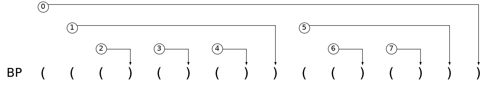
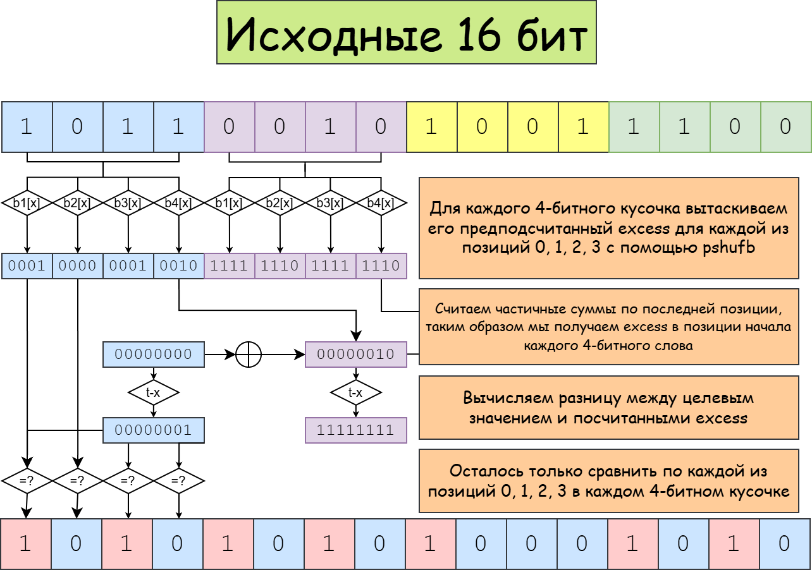

Друзья, знаю, что интернет переполнен воспеванием AI, что вызывает у многих людей (особенно специалистов) фрустрацию, особенно когда речь заходит о написании кода на C/C++. Я не AI-проповедник -- просто активный и ответственный программист, который пользуется AI-инструментами. Недавно я предложил AI (если быть точнее, opencode + GLM-5.1) придумать алгоритм для одной из задач, над которой я работаю, и он справился очень хорошо. Это не прорывной алгоритм, на котором я разбогатею, но он интересный: составленный из известных компонентов, но всё же новый. В статье расскажу:

- Как решать задачу "дана битовая строка, нужно найти все позиции в ней, в которых количество единиц минус количество нулей равно заданному числу"
- Что мне придумал AI для этой задачи
- Что я использую для того, чтобы AI писал что-то адекватное на C++

Если вам интересны алгоритмы и структуры данных, то описанная задача используется в контексте RMQ/LCA.

## Преамбула

Начну с формализации задачи: пусть у нас есть последовательность $B:\{1, \ldots, n\}\rightarrow \{0, 1\}$, где $B[i]$ -- $i$-й бит последовательности. Определим excess как $E_B:\{0, \ldots, n\}\rightarrow \mathbb{Z}$:

$$
E_B[i] = \sum_{j=1}^i 2B[j]-1,
$$

Т.е. $E_B[i]$ -- количество единиц минус количество нулей в первых $i$ битах последовательности $B$. Наша задача: дано $k$, нужно найти такие $i$, что $E_B[i]=k$. Основное назначение этой задачи -- обработка правильных скобочных последовательностей: например, находить парную скобку или ближайшую внешнюю пару скобок. Зачем это нужно? С помощью этого можно делать навигацию по деревьям через скобочное представление. Не хочу вдаваться в подробности; вот простой пример BP-представления: делаем обход в глубину, каждый раз, когда спускаемся на уровень ниже, пишем 1, когда поднимаемся -- 0.




Каждой вершине соответствует пара скобок, а всё поддерево вершины соответствует подпоследовательности скобок между этими скобками. Для навигации полезно по одной скобке находить её парную. В более общем смысле все возможные операции по навигации по дереву сводятся к такой задаче: *дана битовая строка $B$, позиция $i$ и величина $k$. Нужно найти минимальное $j\geq i$ такое, что $E_B[j]=E_B[i]+k$*. Универсальная структура данных для решения этой задачи -- range min-max tree, о котором я расскажу в другой статье. Самое главное, что про него нужно знать:

- Оно решает указанную задачу за $\mathcal{O}(\log n)$
- Для максимальной эффективности строится поверх блоков такой длины, чтобы внутри блока поиск можно было сделать быстро альтернативными методами.

Вот как раз про решение для блоков небольшой длины и разберем дальше.

## Baseline

Исследований на эту тему довольно мало, поэтому приведу метод, который используется в единственной известной мне публичной реализации range min-max tree.

[Sdsl-Lite](https://github.com/simongog/sdsl-lite/blob/master/include/sdsl/bp_support_algorithm.hpp#L48)


По сути, это табличный метод: для каждой возможной последовательности $B$ из 8 бит и значения $k$ вычисляется маска $E_B[i]=k$. Для произвольной последовательности $B$ разбиваем её на блоки по 8 бит, делаем последовательный проход по блокам, на каждом блоке используем таблицу и обновляем $k$. Отмечу, что excess всего блока легко вычисляется как `2*popcount(B)-8`.

## Что предложил GLM-5.1

В SIMD существует возможность параллельно просматривать таблицу с помощью `pshufb`, и существует множество практических применений, основанных на этом. Не совсем понятно, можно ли вообще адекватно обобщить метод из предыдущего раздела. Для применения методов на основе `pshufb` нужны таблицы размера 16; GLM-5.1 предложил следующий вариант:

- Для блока из $4$ бит предподсчитываем excess на каждой из 4 позиций; последняя из них -- excess всего блока.
- Подсчитываем префиксные суммы excess на границах всех 4-битных блоков
- Для каждого 4-битного кусочка `i` и каждого смещения 0, 1, 2, 3 проверяем, равно ли значение `target-E[4i]`.
- Собираем всё вместе в одну результирующую маску.



Предподсчёт -- это 4 таблицы, каждая из которых состоит из 128, 256 или 512 бит.


<details>
<summary>Таблицы excess для AVX-2</summary>

```cpp
// LUT for total excess change across a 4-bit nibble
static inline const __m256i excess_lut_delta = _mm256_setr_epi8(
    -4, -2, -2,  0, // 0000, 0001, 0010, 0011
    -2,  0,  0,  2, // 0100, 0101, 0110, 0111
    -2,  0,  0,  2, // 1000, 1001, 1010, 1011
     0,  2,  2,  4, // 1000, 1001, 1010, 1011
    -4, -2, -2,  0, // 0000, 0001, 0010, 0011 (повтор)
    -2,  0,  0,  2, // 0100, 0101, 0110, 0111 (повтор)
    -2,  0,  0,  2, // 1000, 1001, 1010, 1011 (повтор)
     0,  2,  2,  4  // 1100, 1101, 1110, 1111 (повтор)
);

static inline const __m256i excess_lut_pos0 = _mm256_setr_epi8(
    -1,  1, -1,  1, // 0000, 0001, 0010, 0011
    -1,  1, -1,  1, // 0100, 0101, 0110, 0111
    -1,  1, -1,  1, // 1000, 1001, 1010, 1011
    -1,  1, -1,  1, // 1100, 1101, 1110, 1111
    -1,  1, -1,  1, // 0000, 0001, 0010, 0011 (повтор)
    -1,  1, -1,  1, // 0100, 0101, 0110, 0111 (повтор)
    -1,  1, -1,  1, // 1000, 1001, 1010, 1011 (повтор)
    -1,  1, -1,  1  // 1100, 1101, 1110, 1111 (повтор)
);

static inline const __m256i excess_lut_pos1 = _mm256_setr_epi8(
    -2,  0,  0,  2, // 0000, 0001, 0010, 0011
    -2,  0,  0,  2, // 0100, 0101, 0110, 0111
    -2,  0,  0,  2, // 1000, 1001, 1010, 1011
    -2,  0,  0,  2, // 1100, 1101, 1110, 1111
    -2,  0,  0,  2, // 0000, 0001, 0010, 0011 (повтор)
    -2,  0,  0,  2, // 0100, 0101, 0110, 0111 (повтор)
    -2,  0,  0,  2, // 1000, 1001, 1010, 1011 (повтор)
    -2,  0,  0,  2  // 1100, 1101, 1110, 1111 (повтор)
);

static inline const __m256i excess_lut_pos2 = _mm256_setr_epi8(
    -3, -1, -1,  1, // 0000, 0001, 0010, 0011
    -1,  1,  1,  3, // 0100, 0101, 0110, 0111
    -3, -1, -1,  1, // 1000, 1001, 1010, 1011
    -1,  1,  1,  3, // 1100, 1101, 1110, 1111
    -3, -1, -1,  1, // 0000, 0001, 0010, 0011 (повтор)
    -1,  1,  1,  3, // 0100, 0101, 0110, 0111 (повтор)
    -3, -1, -1,  1, // 1000, 1001, 1010, 1011 (повтор)
    -1,  1,  1,  3  // 1100, 1101, 1110, 1111 (повтор)
);
```

</details>

Про префиксные суммы расскажу чуть подробнее. Обычно подсчёт префиксных сумм -- это тривиальная задача, которую можно сделать вот таким линейным проходом:

В примерах ниже используется 0-based индексация: массив `B` имеет длину `n`, а `E` -- длину `n + 1`.

```cpp
E[0] = 0;
for (size_t i = 1; i <= n; ++i) {
  E[i] = E[i - 1] + B[i - 1];
}
```

Проблема этого алгоритма в том, что его нельзя эффективно параллелизовать, и он делает $\mathcal{O}(n)$ последовательных операций. Для SIMD-варианта лучше использовать следующий алгоритм:

```cpp
std::copy(B.begin(), B.end(), std::next(E.begin(), 1));
E[0] = 0;
for (size_t offset = 1; offset < n; offset *= 2) {
  for (size_t i = n; i >= offset; --i) {
    E[i] += E[i - offset];
  }
}
```

Разница в том, что внутренний цикл легко распараллелить, а внешний цикл делает всего $\log_2 n$ итераций. Вот сниппет кода, который вычисляет префиксные суммы по байтам:

```cpp
ps = _mm256_add_epi8(ps, _mm256_slli_si256(ps, 1));
ps = _mm256_add_epi8(ps, _mm256_slli_si256(ps, 2));
ps = _mm256_add_epi8(ps, _mm256_slli_si256(ps, 4));
ps = _mm256_add_epi8(ps, _mm256_slli_si256(ps, 8));
```

Удобнее всего обрабатывать последовательности длиной 64/128 бит регистрами 128/256 бит соответственно; при необходимости можно использовать 512-битные регистры, распараллеливая две последовательности по 128 бит.

Последние два шага -- дело техники, и их можно сделать разными способами. GLM-5.1 предложил использовать рабочую, но слегка избыточную комбинацию `cmpeq->movemask->pdep`; ниже -- описание workflow от AI:

```
word ──► nibble extraction ──► nibbles[0..15]
                                    │
              ┌─────────────────────┼─────────────────────┐
              ▼                     ▼                     ▼
     vpshufb(delta)          vpshufb(pos_j)         vpshufb(delta)
         deltas                   rel_j                  rel_3
              │                     │                     │
              ▼                     │                     │
     prefix sum (4 steps)           │                     │
              │                     │                     │
              ▼                     │                     │
     shift left 1 byte              │                     │
     → excl (exclusive psum)        │                     │
              │                     │                     │
              ▼                     │                     │
     base = excl - target_local     │                     │
              │                     │                     │
              ▼                     ▼                     ▼
     base + rel_j ───────────► cmpeq(0) ──────────► movemask → bits_j
                                                           │
              ┌────────────────────────────────────────────┤
              ▼                  ▼                  ▼      ▼
           pdep(0x1…)       pdep(0x2…)       pdep(0x4…)  pdep(0x8…)
              │                   │                │      │
              └───────── OR ───────────────────────┘      │
                                  │                       │
                                  ▼                       │
                              out[w] ◄────────────────────┘
```

Проблема в целом заключалась в том, что на всех стадиях алгоритма происходят манипуляции с раскрытием и сжатием чисел/масок: в первой части 4-битные куски раскрываются до 8-битных, при проверке на равенство маска сначала сжимается до 16 бит через `movemask`, а затем расставляется по нужным битам с шагом в 4 через `pdep`. В результате для `pdep` не так легко найти альтернативу, а на текущих архитектурах это 64-битная инструкция из BMI2, SIMD-аналогов которой нет.

Итоговый вариант можно посмотреть здесь:

[pixie/bits.h](https://github.com/Malkovsky/pixie/blob/afe4b2ed4fc452a575acb8965bd21482d00d4fc1/include/pixie/bits.h#L771)

Полную сессию от описания задачи до реализации можно найти здесь:
https://opncd.ai/share/UdTGAEAW

(К сожалению, там очень неудобный интерфейс; по запросу могу выложить md.)

## Анализ производительности

Впоследствии я немного доработал алгоритм, и вот что получилось:

<details>
<summary>Сравнение по производительности на случайных данных</summary>

`X` -- запрашиваемый excess, все замеры на битовой строке длины 512.
```
----------------------------------------------------
Benchmark                CPU     Cycles      Instr
----------------------------------------------------
Baseline/X:-64         317 ns   1.36953k   7.18206k
Baseline/X:-8          400 ns   1.74562k   7.20476k
Baseline/X:0           449 ns   1.93589k   7.21562k
Baseline/X:8           397 ns   1.73994k   7.20387k
Baseline/X:64          317 ns   1.37449k   7.18206k
LUTOffset/X:-64       11.2 ns    48.5127    169.882
LUTOffset/X:-8        18.4 ns    81.4704    250.885
LUTOffset/X:0         18.8 ns      81.94    250.927
LUTOffset/X:8         18.6 ns    81.7102    250.853
LUTOffset/X:64        10.7 ns    46.7245    166.554
LUTTransform/X:-64    16.2 ns    70.4105    260.969
LUTTransform/X:-8     27.5 ns     119.56    409.788
LUTTransform/X:0      26.9 ns   118.3430    409.865
LUTTransform/X:8      27.3 ns   119.1410    409.730
LUTTransform/X:64     15.8 ns    68.7241    254.855
LUTOffset512/X:-64    12.7 ns    54.7855    184.717
LUTOffset512/X:-8     18.8 ns    81.4390    228.987
LUTOffset512/X:0      18.4 ns    79.5516    228.987
LUTOffset512/X:8      17.7 ns    78.0454    228.973
LUTOffset512/X:64     12.6 ns    54.9331    182.469
Expand16/X:-64        51.2 ns   221.2250    823.130
Expand16/X:-8         84.8 ns   366.6420   1.37054k
Expand16/X:0          84.9 ns   366.7350   1.37077k
Expand16/X:8          85.7 ns   368.6010   1.37031k
Expand16/X:64         49.7 ns   219.0660    795.162
Expand8/X:-64         18.7 ns    80.4250    327.100
Expand8/X:-8          49.1 ns   213.1080    732.712
Expand8/X:0           47.6 ns   205.9740    740.490
Expand8/X:8           47.3 ns   205.6490    733.577
Expand8/X:64          18.1 ns    78.4455    326.288
Expand8_512/X:-64     22.5 ns    98.3215    255.677
Expand8_512/X:-8      37.1 ns   161.9560    336.860
Expand8_512/X:0       36.7 ns   160.9130    336.951
Expand8_512/X:8       36.8 ns   161.6340    336.823
Expand8_512/X:64      22.1 ns    96.5108    253.321
```

</details>

`LUTOffset` -- это немного доработанный вариант, описанный в предыдущем разделе; baseline -- табличный байтовый метод. Разница -- примерно в 20 раз. Вариант с `pdep` работал где-то на 20% медленнее, что всё ещё на порядок быстрее.

## Новый ли подход?

Учитывая, как бодро AI его мне придумал, я сначала подумал, что такой подход уже где-то описан. Однако я так и не нашёл такого алгоритма и пришёл к следующим выводам:

- Все компоненты и отдельные трюки в этом подходе известны и повсеместно применяются (4-битные таблицы, алгоритм подсчета префиксных сумм, паттерн с `pdep`)
- Их компоновка в единый алгоритм -- новая

Отмечу, что моя роль в разработке конкретно этого метода свелась к промпту: "Подумай, пожалуйста, над алгоритмом для excess на основе 4-битных таблиц".

## Что я использую для работы с AI

Начнём с того, что для работы был использован `kilocode`; на текущий момент его CLI-версия -- это `OpenCode` с некоторыми дополнениями. Для оптимизации C++-кода я использую дополнительный набор навыков, которые задают конкретный workflow, суть которого сводится к следующему:

- Используй Google Benchmark для замеров производительности. Всё, что не было замерено, -- это домыслы.
- Используй Google Test для покрытия тестами: производительный, но некорректный код не имеет смысла.
- Используй изолированные сборки для оценки влияния конкретных изменений на производительность.

Подробнее можно посмотреть здесь:

[pixie/.kilo/skills](https://github.com/Malkovsky/pixie/tree/main/.kilo/skills)

Планирую выделить это в отдельный репозиторий и развивать дальше.

## Заключение

Из того, что я вижу сейчас, глобальных блокеров для того, чтобы AI помогал писать код на C++, нет. Однако мало кто этим пытается заниматься. Проблемы, конечно, есть: например, если спросить, зачем нужен AddressSanitizer, AI прекрасно распишет, что и как он помогает диагностировать, но сам при написании кода не запустит ASan-сборку, если явно не потребовать. AI может помогать с отладкой; если не верите, можете посмотреть вот это видео с последнего [CppCon](https://www.youtube.com/watch?v=DwhAucfHJjs), но это тоже требует настройки.
