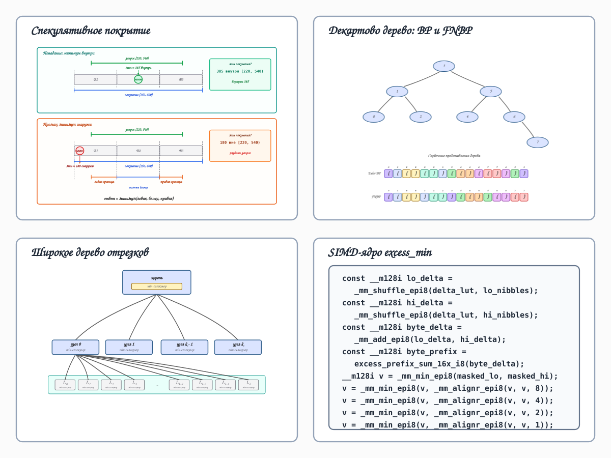
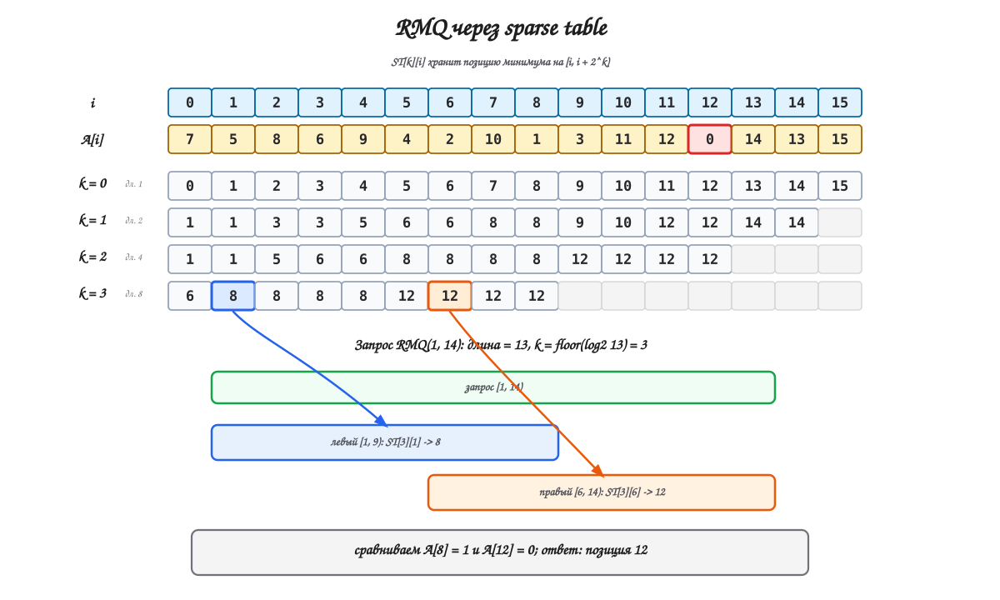
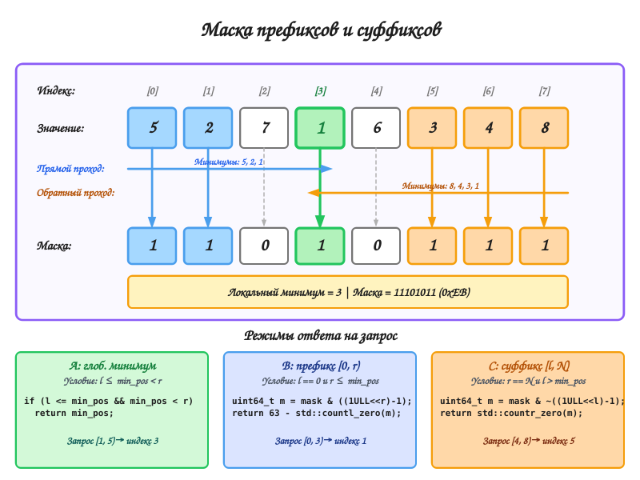
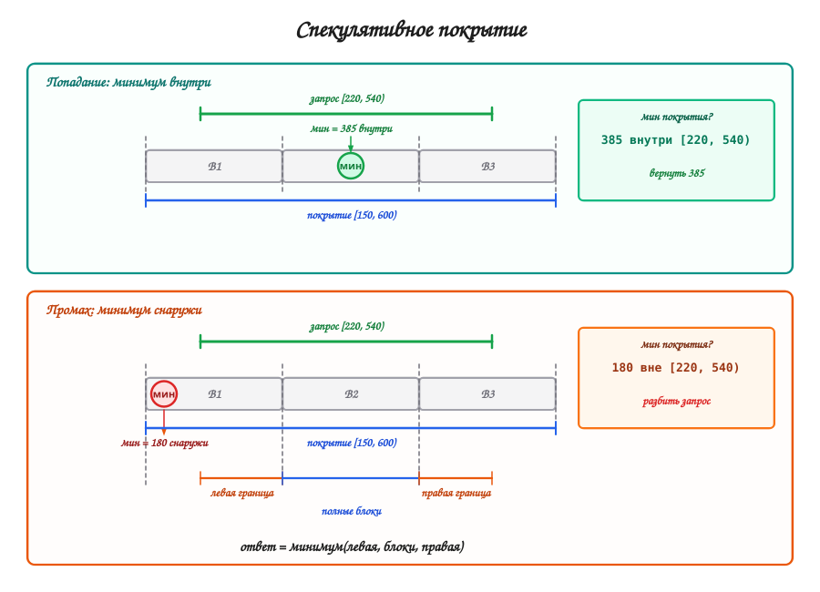
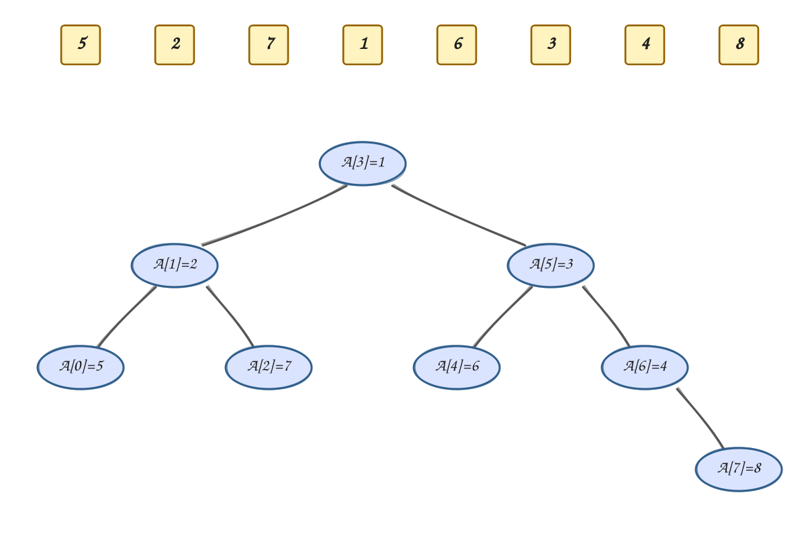
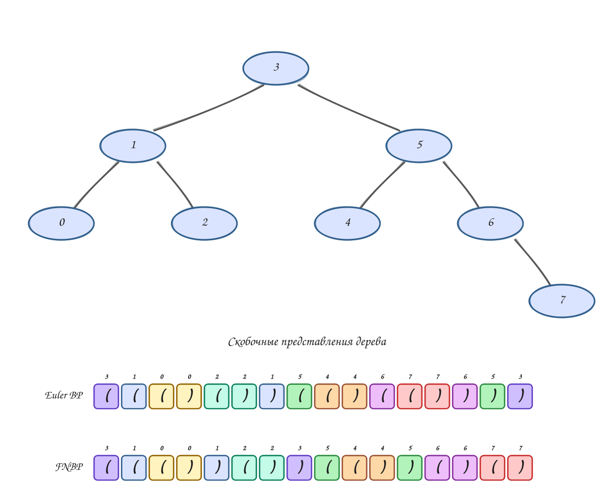
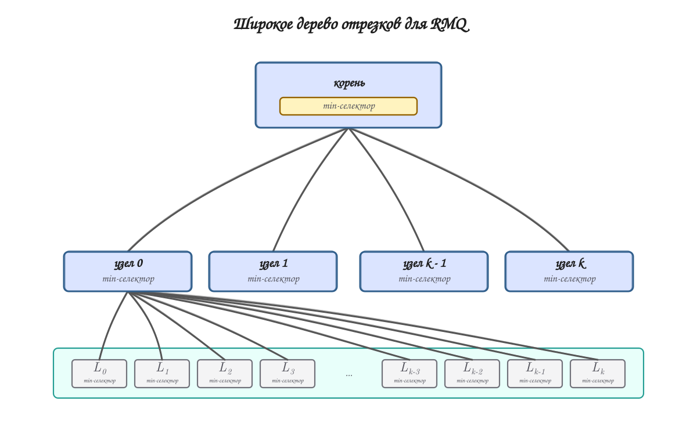
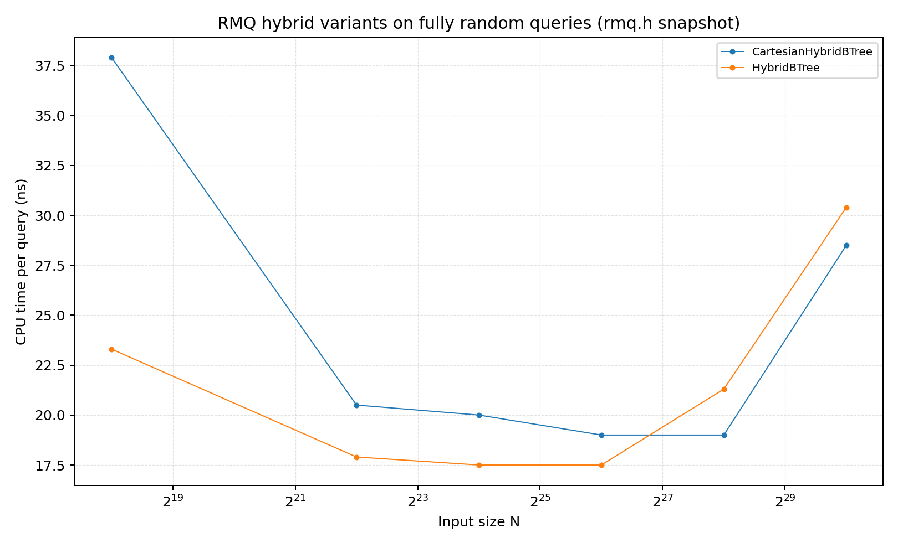

*Range minimum query* -- это классическая задача, в этой заметке решаем статический вариант. Есть массив $A[0..n-1]$; нужно построить
структуру данных, которая быстро отвечает на запрос

$$
RMQ(l, r) = \arg \min_{i \in [l, r)} A[i].
$$

Я собрал несколько практических наработок и сделал из них два очень компактных и быстрых варианта:

- вариант с $1.05n$ дополнительных бит, которому иногда нужно обращаться к исходному массиву;
- вариант с $2.1n$ дополнительных бит, который отвечает на запросы без доступа к исходному массиву.

Обе реализации очень быстры на практике: на случайных
запросах по массиву размера $10^9$ элементов они работают в среднем за $20$--$30$ нс на запрос.

Для ориентира: [туториал Codeforces по блочному RMQ](https://codeforces.com/blog/entry/78931)
описывает структуру, которая работает $\sim 100$ нс на запрос для массивов длины $10^7$ с 32-битными
целыми числами, при этом используя $32n$ дополнительных бит.

## Ремарка об использовании AI

AI активно использовался при подготовке текста, кода, экспериментов и
иллюстраций для этой статьи. Автор (Николай Мальковский) полностью ответственен за
содержание, а также за возможные ошибки и неточности.

## Блочный RMQ

Основой почти любого практического решения статического RMQ служит
*разреженная таблица* (*sparse table*). Если вы не знакомы с этой структурой, то рекомендую посмотреть в
[статье cp-algorithms про sparse table](https://cp-algorithms.com/data_structures/sparse-table.html).

Идея sparse table проста: для каждой позиции $i$ заранее посчитаем
$RMQ(i, i + 2^k)$ для всех $k$ таких, что $i + 2^k \leq n$. Чтобы ответить на
$RMQ(l, r)$, выбираем $k$ такое, что $2^k \leq r - l < 2^{k+1}$, и сравниваем
минимумы на двух перекрывающихся отрезках: $RMQ(l, l + 2^k)$ и
$RMQ(r - 2^k, r)$.

{fig-alt="Строки sparse table хранят позиции минимумов для отрезков степенной длины; запрос отвечается сравнением двух перекрывающихся отрезков."}

Sparse table хороша и теоретически, и практически, но платит за это
$\mathcal{O}(n \log n)$ памяти. Для 64-битных элементов такая таблица перестаёт
помещаться в типичные L3-кэши уже примерно на $10^5$ элементах. Чтобы
масштабироваться дальше, можно перейти к блочной схеме: разбиваем массив на блоки
размера $b$, решаем RMQ по целым блокам с помощью sparse table, а граничные
части запроса досчитываем каким-нибудь другим способом.

В качестве примера, классическое решение задачи LCA (*least common ancestor*, *наименьший общий предок*) с $\mathcal{O}(n)$ памятью, построением за
$\mathcal{O}(n)$ и $\mathcal{O}(1)$ запросами, предложенное
[@bender2000], устроено именно так. Задача LCA сводится решению $RMQ\pm 1$ -- это такой специальный вид $RMQ$, в котором соседние элементы различаются ровно на единицу. Если выбрать
$b = \frac{\log_2 n}{2}$, то структурно есть всего $2^b$ возможных вариантов $RMQ\pm 1$ и их можно заранее посчитать. Чтобы ответить на запрос нужно:

- Если запрос лежит внутри одного блока, то ответ на него мы знаем из заранее посчитанных таблиц.
- Если запрос не лежит внутри одного блока, то его можно разделить на $3$ части: суффикс первого блока, префикс последнего блока и несколько целых блоков (возможно ноль). Хвосты берутся из таблиц для блоков, а отрезок из целых блоков покрывается разреженными таблицами

Далее мы будем ссылкаться на эту идею как на FCB. Практические реализации
часто сохраняют эту общую форму, но меняют способ обработки граничных и
внутриблочных запросов. Хороший прикладной разбор есть в
[туториале Codeforces про блочный RMQ](https://codeforces.com/blog/entry/78931).

## Замечания про обращения к памяти

На длинных массивах $RMQ$ часто упирается не в количество арифметических операций,
а в обращения к памяти. RAM существенно медленнее кэша процессора, поэтому
кэш-промахи быстро становятся главным ограничением. В sparse table это хорошо
видно: как только таблица перестаёт помещаться в кэш, цена случайного запроса
заметно растёт.

У sparse table при этом есть полезная особенность. Для равномерно случайных
запросов примерно половина интервалов имеет длину хотя бы $n/2$, то есть
отвечается с верхних уровней таблицы. Из-за этого оказывается выгодным группировать значения по уровням для лучшей локальности данных. Из-за этой особенности sparse table для последовательности размера $10^7$
всё ещё может работать за примерно $20$--$30$ нс на случайный запрос, хотя
полная таблица занимает уже несколько гигабайт.

## Базовые оптимизации

### Кодирование префиксных и суффиксных минимумов

Начнём с оптимизации из
[туториала Codeforces про блочный RMQ](https://codeforces.com/blog/entry/78931).

Вот её суть. Давайте заранее подсчитаем ответы на все префиксные запросы внутри
блока: идём слева
направо и сохраняем позицию каждый раз, когда встретили новый минимум. Тогда
ответ на запрос $[0, r)$ -- это последняя сохранённая позиция, меньшая $r$; её
можно найти бинарным поиском. Например, для массива
$[5, 2, 7, 1, 6, 3, 4, 8]$ позиции префиксных минимумов равны $[0, 1, 3]$.

Суффиксные запросы устроены симметрично. Для коротких блоков такие
последовательности удобно кодировать битовой маской. Более того, для блока длины
$n$ одной $n$-битной маски хватает и для префиксных, и для суффиксных минимумов.
Чтобы отвечать на запросы, дополнительно нужна только позиция глобального
минимума $m$:

- для префикса $[0, r)$ зануляем биты в позициях не меньше $\min(r, m + 1)$ и
  ищем старший установленный бит;
- для суффикса $[l, n)$ зануляем биты в позициях меньше $\max(l, m)$ и ищем
  младший установленный бит.

На рисунке показана такая префиксно-суффиксная маска для массива
$A = [5, 2, 7, 1, 6, 3, 4, 8]$ и несколько типов запросов, которые из неё
получаются:

{fig-alt="Ответы на префиксные и суффиксные RMQ-запросы с помощью одной битовой маски и позиции минимума."}

Такой информации всё ещё недостаточно для произвольного запроса внутри блока.
Один способ закрыть этот случай -- хранить отдельную маску для каждой стартовой
позиции, но это слишком расточительно. На самом деле в таких ситуациях проще сделать линейный проход по исходному массиву. Разумеется, в некоторых ситуациях нам нужны будут именно такие запросы и в этом случае такое решение оказывается неудачным. Но если ориентироваться на случайные запросы, то такая ситуация -- редкость. Для такого блока нужна
$n$-битная маска и позиция минимума; хорошим практическим вариантом будет
$248 + 8$ бит.

### Спекулятивная проверка покрывающим интервалом

В блочной схеме запрос обычно делится на три части: левый граничный блок,
средние полные блоки и правый граничный блок. Если запрос целиком лежит внутри
одного блока, остаётся один внутриблочный запрос. Проблема в том, что полные блоки обычно обрабатываются очень быстро через
sparse table, а граничные блоки -- медленно.

Оказывается, выгоднее сначала сделать другую проверку: берём минимальный диапазон
блоков, который полностью покрывает исходный запрос. Если минимум этого
покрывающего интервала лежит внутри исходного запроса, то это и есть ответ.
Это и есть *спекулятивная проверка* -- она очень дешева, но при этом срабатывает
на большей части запросов.

Идея взята из работы Kowalski и Grabowski *Faster Range Minimum
Queries* [@Kowalski2017FasterRMQ].

{fig-alt=""}

## Декартово дерево

Следующий необходимый для нас объект -- *декартово дерево*. Оно полностью
описывает структуру минимумов на подотрезках массива и строится рекурсивно:
минимум всего массива становится корнем дерева, часть слева от минимума образует
левое поддерево корня, а часть справа -- правое поддерево. Для массива $[5, 2, 7, 1, 6, 3, 4, 8]$ получается
такое дерево:

{fig-alt="Декартово дерево для массива из восьми элементов"}

Декартово дерево полезно для RMQ, потому что запрос RMQ можно свести к запросу
LCA в этом дереве, т.е. нахождение наименьшего общего предка двух вершин. Про LCA мы уже писали, что она в свою очередь сводится к более простой задаче $RMQ\pm 1$ [@bender2000]

Декартово дерево также связано с префиксными и суффиксными минимумами из
предыдущего раздела: эти минимумы лежат на крайних путях дерева.

Для нашей цели важнее другое: такую последовательность $RMQ \pm 1$ можно хранить
как бинарную строку, где `0` означает изменение глубины на $-1$, а `1` -- на
$+1$.

- Сведение через декартово дерево даёт RMQ-представление примерно в $2$ бита на
  элемент.
- Короткие декартовы деревья на $64$--$256$ вершин быстрее обрабатывать специальными SIMD алгоритмами.

Дальше нам не понадобится полный разбор классического сведения. Основная задача, которую нам нужно научиться делать быстро с помощью SIMD: дана бинарная последовательность
$B:\{1, \ldots, n\}\rightarrow \{0, 1\}$; определим *excess* как баланс после
прочтения первых $i$ битов:

$$
E_B[i] = \sum_{j=1}^i (2B[j]-1).
$$

Нужно найти первую позицию, на которой достигается минимум $E_B$ на произвольном интервале.

### Компактный вариант декартова дерева

FCB-подход строит эйлеров обход дерева. Компактная альтернатива -- правильная
скобочная последовательность (BP): при входе в вершину пишем `(`, при выходе -- `)`.
Такое представление работает, но для RMQ удобнее другой порядок скобок. Обозначим
через `FNBP(node)` представление поддерева с корнем `node`. Для вершины с левым и
правым ребёнком оно записывается так:

```text
"(" FNBP(left child of node) ")" FNBP(right child of node)
```

{fig-alt="Два варианта представления декартово дерева через скобочные последовательности"}


Это BP представление Ferrada--Navarro [@Ferrada2017]. У него
есть два важных свойства:

- последовательность можно построить одним линейным проходом;
- $i$-я закрывающая скобка соответствует $i$-му элементу массива.

Чтобы получить LCA в этом представлении, нужно найти самую левую позицию с
минимальным excess между закрывающими скобками двух вершин. Эта позиция стоит
рядом с закрывающей скобкой LCA. Переход от индекса массива $i$ к позиции его
закрывающей скобки -- это `select0(i + 1)`, то есть позиция $(i+1)$-го нуля.
Обратный переход -- `rank0(pos) - 1`: считаем число нулей до позиции `pos` и
переходим от нумерации с единицы к нумерации с нуля. Для коротких последовательностей
rank и select хорошо ложатся на инструкции CPU: `POPCNT` для rank, `PDEP` и
`TZCNT` для select. Для длинных последовательностей обычно добавляют
сэмплированный индекс.

FNBP-последовательность для декартова дерева можно построить обратным проходом
со стеком.

```cpp
auto bp_sequence = ...;

for (size_t i = n; i-- > 0;) {
  while (!stack.empty() && A[stack.back()] >= A[i]) {
    stack.pop_back();
    prepend_open(bp_sequence);  // '('
  }

  stack.push_back(i);
  prepend_close();   // ')', one per array entry
}

while (bp.size() != 2 * n) {
  prepend_open(bp_sequence);    // final unmatched stack entries
}
```

Каждый элемент массива порождает ровно одну закрывающую скобку в момент, когда
попадает в стек. Проход идёт справа налево, новые биты добавляются в начало,
поэтому в итоговой BP-последовательности закрывающие скобки идут в порядке
элементов массива. Отсюда и получается соответствие: закрывающая скобка элемента
`i` находится в позиции `select0(i + 1)`. Открывающие скобки кодируют
вложенность, которая появляется из вытеснений в стеке и финальной очистки;
закрывающие скобки служат идентификаторами позиций массива.

Для нашего примера FNBP-последовательность выглядит так:

```text
bp position:   0  1  2  3  4  5  6  7  8  9 10 11 12 13 14 15
paren:         (  (  (  )  )  (  )  )  (  (  )  )  (  )  (  )
excess:     0  1  2  3  2  1  2  1  0  1  2  1  0  1  0  1  0
array index:            0  1     2  3        4  5     6     7
```

Чтобы ответить на value-RMQ-запрос `[l, r)`, переводим `l` и `r - 1` в позиции
их закрывающих скобок, ищем минимум excess между этими позициями и переводим
ответ обратно:

```text
first_close = select0(l + 1)
last_close  = select0(r)
depth query = [first_close + 1, last_close + 2)
answer      = rank0(excess_min(depth query).position) - 1
```

В оставшейся части раздела будем использовать запрос `[0, 6)`. Он превращается в

```text
first_close = select0(0 + 1) = 3
last_close  = select0(6)     = 11
depth query = [4, 13)
```

Для коротких BP-блоков `select0` можно считать без полноценного индекса. Если
блок помещается в одно 64-битное слово, позиция `k`-го нуля в нумерации с
единицы находится через `PDEP` и `TZCNT`:

```cpp
uint64_t zeros = ~word & valid_bits_mask;
uint64_t selected = _pdep_u64(1ull << (k - 1), zeros);
uint32_t pos = _tzcnt_u64(selected);
```

`zeros` отмечает закрывающие скобки. `PDEP` помещает единственный бит
`1 << (k - 1)` в `k`-ю установленную позицию маски `zeros`, а `TZCNT` переводит
получившуюся маску с одним установленным битом в номер бита. `select1`
считается так же, только берётся `word`, а не `~word`. Для 128-битного блока сначала проверяем первое
64-битное слово; если нулей в нём недостаточно, вычитаем их число и переходим ко
второму слову.

Поиск минимума excess интереснее: здесь используются несколько параллельных
табличных обращений. Ниже разберём 16-битный пример, хотя естественная единица
реализации -- 128-битный SIMD-регистр.

Разобьём 16 бит на четыре 4-битных блока.

```text
chunk index:   0     1     2     3
positions:     0..3  4..7  8..11 12..15
bits:          1110  0100  1100  1010
```

Для каждого 4-битного блока храним в таблице три значения:

```text
delta      = суммарное изменение excess после 4 битов
local_min  = минимум excess после чтения хотя бы одного бита
offset     = первый локальный сдвиг 1..4, где достигается local_min
```

```text
chunk:                 0       1        2       3
bits:               1110    0100     1100    1010
local prefixes:  1,2,3,2 -1,0,-1,-2 1,2,1,0 1,0,1,0
delta:               +2      -2        0       0
local_min:           +1      -2        0       0
offset:               1       4        4       2
```

Запрос `[4, 13)` начинается с блока `1` и заканчивается после первого бита блока
`3`. Если считать по блокам скалярно, нам нужна эксклюзивная префиксная сумма
`delta`: она даёт базовый excess перед каждым блоком. Неактивные блоки
игнорируются, а для правого граничного блока берётся частичный табличный ответ:

```text
chunk:            0     1     2     3
active bits:      -  0100  1100     1
base excess:      -    +2     0     0
candidate value:  -     0     0     1
candidate pos:    -     8    12    13
```

Теперь сделаем тот же расчёт в SIMD, но не будем смешивать младшие и старшие
полубайты в один поток. 128-битный блок загружается как набор байтов; из каждого
байта получаем младший и старший 4-битный блок:

```text
byte index:    0     1
low 4 bits:   1110  1100     // block indices 0, 2
high 4 bits:  0100  1010     // block indices 1, 3
```

В коде это выглядит так:

```cpp
const __m128i excess_lut_nibble_mask_sse = _mm_set1_epi8(0x0F);
const __m128i excess_lut_delta_sse = _mm_setr_epi8(
    -4, -2, -2,  0, // 0000 0001 0010 0011
    -2,  0,  0,  2, // 0100 0101 0110 0111
    -2,  0,  0,  2, // 1000 1001 1010 1011
     0,  2,  2,  4  // 1100 1101 1110 1111
);

const __m128i bytes = _mm_loadu_si128(reinterpret_cast<const __m128i*>(s));
const __m128i lo_nibbles =
    _mm_and_si128(bytes, excess_lut_nibble_mask_sse);
const __m128i hi_nibbles =
    _mm_and_si128(_mm_srli_epi16(bytes, 4), excess_lut_nibble_mask_sse);
```

`excess_lut_nibble_mask_sse` -- это 16-байтный SSE-регистр, в каждом байте
которого лежит `00001111` (`0x0F`). Первый `and` извлекает младший 4-битный
блок из каждого входного байта. Для старших блоков `_mm_srli_epi16(bytes, 4)`
сдвигает каждую 16-битную ячейку на четыре бита вправо; второй `and` очищает
биты соседнего байта, которые могли попасть в результат из-за 16-битного сдвига.
В итоге в каждом байтовом элементе остаётся чистый индекс от `0` до `15` для
табличного поиска через `_mm_shuffle_epi8`.

`excess_lut_delta_sse` -- это 16-элементная таблица полного изменения excess для
4-битного блока. Бит `1` даёт `+1`, бит `0` даёт `-1`, поэтому

```text
delta[code] = 2 * popcount(code) - 4
```

Например, для кода `0000` delta равна `-4`, для `0001` -- `-2`, для `0111` --
`+2`, а для `1111` -- `+4`. Таблица хранится в порядке 4-битных кодов, потому
что `_mm_shuffle_epi8(table, nibbles)` читает каждый байт `nibbles` как индекс
в таблице и возвращает соответствующую delta.

Табличное чтение delta выполняется по байтовым элементам SIMD-вектора. Младшие
полубайты содержат блоки `0` и `2`; старшие полубайты -- блоки `1` и `3`:

```text
byte index:     0      1
low bits:    1110   1100
low code:       7      3
lo_delta:      +2      0

high bits:   0100   1010
high code:      2      5
hi_delta:      -2      0

byte_delta:     0      0   // lo_delta + hi_delta
```

В SIMD-коде это два shuffle и одно сложение:

```cpp
const __m128i lo_delta = _mm_shuffle_epi8(excess_lut_delta_sse, lo_nibbles);
const __m128i hi_delta = _mm_shuffle_epi8(excess_lut_delta_sse, hi_nibbles);
const __m128i byte_delta = _mm_add_epi8(lo_delta, hi_delta);
```

Теперь префиксная сумма считается не по отдельным 4-битным блокам, а по
суммарной delta каждого байта. Элемент `i` в `byte_prefix` хранит excess после
байта `i`. Следующий код -- обычная параллельная префиксная сумма по 16 байтам
со знаком. Каждый сдвиг распространяет частичные суммы на расстояния `1`, `2`,
`4` и `8` байт:

```cpp
static inline __m128i excess_prefix_sum_16x_i8(__m128i v) noexcept {
  v = _mm_add_epi8(v, _mm_slli_si128(v, 1));
  v = _mm_add_epi8(v, _mm_slli_si128(v, 2));
  v = _mm_add_epi8(v, _mm_slli_si128(v, 4));
  v = _mm_add_epi8(v, _mm_slli_si128(v, 8));
  return v;
}
```

В нашем примере задействованы только первые два байта. Суммарная delta каждого
из них равна нулю, поэтому инклюзивная префиксная сумма тоже нулевая:

```text
byte_prefix:         [ 0, 0 ]
byte_prefix_before:  [ 0, 0 ]
```

`byte_prefix` означает "excess после байта". В общем виде для
`byte_delta = [d0, d1, d2, ...]` получаем:

```text
byte_prefix:         [d0, d0+d1, d0+d1+d2, ...]
byte_prefix_before:  [ 0,    d0,    d0+d1, ...]
```

`byte_prefix_before` -- это `byte_prefix`, сдвинутый на один байт с нулём в
первом элементе; он даёт excess перед текущим байтом. Это нужно потому, что
младший 4-битный блок начинается на границе байта, а старший -- после младшего.
Значит, база для старшего блока равна `byte_prefix_before + lo_delta`.

```cpp
const __m128i byte_prefix = excess_prefix_sum_16x_i8(byte_delta);
const __m128i byte_prefix_before = _mm_slli_si128(byte_prefix, 1);
```

Следующее табличное чтение даёт локальный минимум внутри каждого полного
4-битного блока. Таблица `excess_lut_min_sse` устроена так же, как таблица
`delta`: входной полубайт используется как индекс, а результатом становится
минимальный локальный excess после чтения хотя бы одного бита блока.

```cpp
__m128i lo_local_min = _mm_shuffle_epi8(excess_lut_min_sse, lo_nibbles);
__m128i hi_local_min = _mm_shuffle_epi8(excess_lut_min_sse, hi_nibbles);
```

В настоящем запросе границы редко совпадают с границами 4-битных блоков. В
рабочей реализации граничные полубайты удобнее обрабатывать отдельно: либо
скалярной маленькой таблицей, либо той же таблицей, но с маской активных
позиций. SIMD-середина тогда получает только полные 4-битные блоки. В нашем
примере левая граница уже совпала с началом блока `1`, а правая обрезает блок
`3` до первого бита. Чтобы не разносить пример на два случая, ниже мы просто
подставим для блока `3` частичный минимум `+1` вместо полного минимума блока
`1010`.

```text
lo_local_min:       [ +1, 0 ]     // у 1110 минимум +1; у 1100 минимум 0
hi_local_min full:  [ -2, 0 ]     // у 0100 минимум -2; у 1010 минимум 0
hi_local_min used:  [ -2,+1 ]     // у блока 3 активен только первый бит: 1
```

Младший 4-битный блок начинается на границе байта и использует базу
`byte_prefix_before`. Старший начинается после младшего, поэтому к его базе
добавляется `lo_delta`:

```text
lo_candidates = byte_prefix_before + lo_local_min
              = [0, 0] + [1, 0]
              = [1, 0]

hi_candidates = byte_prefix_before + lo_delta + hi_local_min
              = [0, 0] + [2, 0] + [-2, +1]
              = [0, 1]
```

```cpp
const __m128i lo_candidates =
    _mm_add_epi8(byte_prefix_before, lo_local_min);
const __m128i hi_candidates =
    _mm_add_epi8(_mm_add_epi8(byte_prefix_before, lo_delta), hi_local_min);
```

Остаётся убрать влияние неактивных блоков. Концептуально активная часть
запроса `[4, 13)` выглядит так:

```text
chunk:                 0       1        2       3
bits:               1110    0100     1100    1010
active part:           -    0100     1100       1
```

Неактивные кандидаты заменяются специальным значением `127`. Оно заведомо больше
любого excess внутри 128-битного блока, поэтому не может стать минимумом:

```text
masked_lo = [127, 0]
masked_hi = [  0, 1]
```

Сначала сравниваем кандидатов из младшего и старшего 4-битного блока внутри
каждого байта:

```text
pairwise_min = min(masked_lo, masked_hi)
             = [0, 0]
```

Затем сводим 16 байтовых элементов со знаком к одному скалярному минимуму.
Здесь `_mm_alignr_epi8(v, v, shift)` используется как циклический сдвиг того же
регистра на `shift` байтов. После сравнений со сдвигами `8`, `4`, `2` и `1`
каждый байтовый элемент содержит минимум по исходным 16 элементам; читать можно
первый байт.

```cpp
v = _mm_min_epi8(v, _mm_alignr_epi8(v, v, 8));
v = _mm_min_epi8(v, _mm_alignr_epi8(v, v, 4));
v = _mm_min_epi8(v, _mm_alignr_epi8(v, v, 2));
v = _mm_min_epi8(v, _mm_alignr_epi8(v, v, 1));
candidate_min = static_cast<int>(
    static_cast<int8_t>(_mm_extract_epi8(v, 0)));
```

В этом примере:

```text
candidate_min = 0
```

Теперь нужно найти первый 4-битный блок, где достигается этот минимум. Для этого
сравниваем `masked_lo` и `masked_hi` с `candidate_min`, переводим результат в
битовые маски через `movemask`, берём первый установленный бит и пересчитываем
номер байтового элемента в номер 4-битного блока:

```text
masked_lo == 0: [false, true ]  => low byte 1  => block index 2
masked_hi == 0: [true,  false]  => high byte 0 => block index 1
first winning block index = min(2 * 1, 2 * 0 + 1) = 1
```

После этого из таблицы `offset` берётся первая локальная позиция минимума внутри
победившего блока. Важно, что `local_offset` лежит в диапазоне `1..4`: он
нумерует не бит внутри блока, а позицию excess после чтения соответствующего
числа битов. Для блока `1`, то есть `0100`, локальный минимум `-2` впервые
достигается после четырёх битов.

```text
excess position = 4 * block_index + local_offset
                = 4 * 1 + 4
                = 8
```

Это первая внутренняя позиция нулевой глубины в BP-последовательности. В запросе
`[4, 13)` позиция `12` тоже достигает глубины `0`, но правило первого минимума
выбирает позицию `8`. Значит, `RMQ(0, 6)` возвращает
`rank0(8) - 1 = 3`, то есть позицию `A[3] = 1`.

Для короткого BP-блока `rank0(pos)` -- это обычный `popcount` по нулевым битам
перед `pos`, ограниченный маской:

```cpp
static inline uint32_t rank0_u64(uint64_t word, uint32_t pos) noexcept {
  uint64_t before = pos == 64 ? ~uint64_t{0} : ((uint64_t{1} << pos) - 1);
  return std::popcount((~word) & before);
}
```

Для `pos = 8` маска оставляет BP-биты `0..7`; среди них четыре нуля, поэтому
`rank0(8) = 4`, а позиция массива равна `4 - 1 = 3`.

## Широкое дерево отрезков

Последний компонент решения -- широкое сегментное дерево. Подробное
объяснение этой идеи есть в статье Сергея Слотина про сегментные деревья на
Algorithmica [@Slotin2022SegmentTrees]. В обычном сегментном дереве у узла два
ребёнка, поэтому дерево получается высоким и плохо использует SIMD-параллелизм и
кэш-линии. B-tree-вариант увеличивает число детей в узле, уменьшает высоту и
оставляет локальную работу достаточно маленькой, чтобы выполнять её с помощью
SIMD.

{fig-alt="Главная локальная задача внутри узла -- найти минимум в диапазоне детей. Для этого используется локальное декартово дерево."}

Для RMQ добавим одно важное изменение. В базовом подходе степень ветвления узла
$B$ обычно выбирается так, чтобы $B$ значений помещались в SIMD-регистр или
кэш-линию. В RMQ вместо самих значений можно хранить локальное декартово дерево
по минимумам детей. Это позволяет поднять степень ветвления до $B=256$: такое
локальное декартово дерево помещается в 64 байта.

## Итоговые решения

Теперь соберём два варианта из описанных выше компонентов. Первый вариант иногда
обращается к исходному массиву:

- каждый блок из $L=496$ элементов хранит префиксно-суффиксную маску и
  16-битную позицию минимума;
- по крупным блокам размера $S$ строится sparse table; $S$ выбирается так, чтобы
  эта таблица занимала всего несколько мегабайт и уверенно помещалась в L3-кэш;
- по блокам размера $L$ строится широкое сегментное дерево со степенью ветвления
  $256$; в каждом внутреннем узле хранится локальное декартово дерево по минимумам
  детей.

Запрос обрабатывается так:

- сначала берём покрывающий отрезок из $S$-блоков и спрашиваем sparse table; если
  найденная позиция лежит внутри исходного запроса, сразу возвращаем её;
- если быстрый путь не сработал, выбираем минимум из трёх кандидатов: левого
  граничного $S$-блока, середины из полных $S$-блоков и правого граничного
  $S$-блока;
- граничные блоки обрабатываются широким сегментным деревом, середина -- sparse
  table;
- префиксные и суффиксные запросы внутри $L$-блоков отвечаются по маске, а
  внутренние запросы внутри $L$-блока просматривают исходный массив линейно.

Второй вариант похож, но вместо доступа к исходному массиву строит глобальное
декартово дерево. Поэтому все запросы отвечаются только по компактному индексу.

На графике ниже показано время работы гибридных вариантов на полностью случайных
запросах для размеров, для которых есть измерения:

{fig-alt="Времена случайных запросов для вариантов RMQ HybridBTree и CartesianHybridBTree."}

Итоговые реализации доступны в Pixie [@Malkovsky2026Pixie]. Точка входа --
заголовочный файл RMQ [`include/pixie/rmq.h`](https://github.com/Malkovsky/pixie/blob/main/include/pixie/rmq.h),
а соответствующие реализации -- классы `HybridBTree` и `CartesianHybridBTree`.

## О Pixie

Я работаю над библиотекой компактных структур данных [pixie](https://github.com/Malkovsky/pixie). Описанные решение задачи RMQ являются её частью, если вам тоже инетересно поработать над state of the art решениями подобных задач -- свяжитесь со мной.

## Список литературы

::: {#refs}
:::
